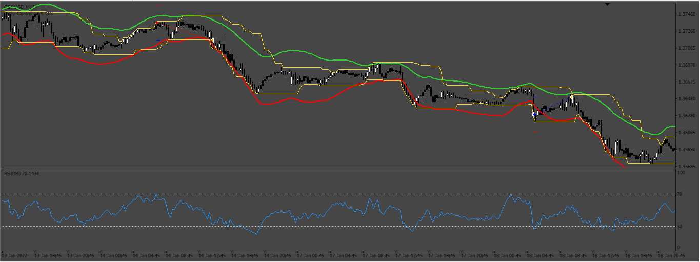
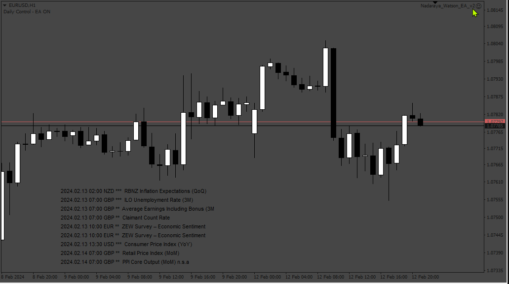
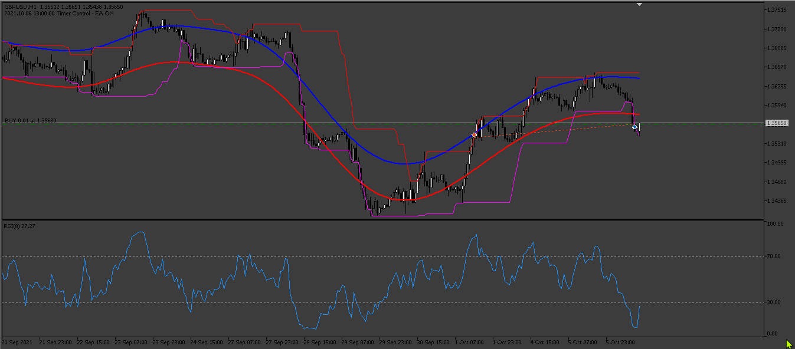

# Nadaraya_Watson_EA

> Source: https://fxcodebase.com/code/viewtopic.php?f=38&t=74279  
> Forum: 38 · Topic 74279 · 8 post(s)

---

## Nadaraya_Watson_EA

**Apprentice** · Tue Oct 24, 2023 3:55 am

Based on the request.
[https://fxcodebase.com/code/viewtopic.php?f=27&p=152929](https://fxcodebase.com/code/viewtopic.php?f=27&p=152929)

 [Donchian.mq4](files/153037/Donchian.mq4)

 [NadarayaWatsonEnvelopes.mq4](files/153037/NadarayaWatsonEnvelopes.mq4)

 [Nadaraya_Watson_EA.mq4](files/153037/Nadaraya_Watson_EA.mq4)

---

## Re: Nadaraya_Watson_EA

**lebarry** · Tue Oct 24, 2023 6:07 pm

Dear Apprentice,

Thank You so much for your awesome work! The trades on your picture look promising. However I get these messages when using the strategy tester. Is there something wrong on my side? [https://drive.google.com/file/d/1AIAnyW ... sp=sharing](https://drive.google.com/file/d/1AIAnyWFC2PIvy-ildZNdZaPuSzlze3BP/view?usp=sharing)

---

## Re: Nadaraya_Watson_EA

**Apprentice** · Thu Oct 26, 2023 2:27 am

We have added your request to the development list.
Development reference 966

---

## Re: Nadaraya_Watson_EA

**crypto0014** · Wed Nov 08, 2023 1:08 am

Ea does not load on chart.

---

## Re: Nadaraya_Watson_EA

**melinas** · Fri Nov 10, 2023 8:09 pm

Is it possible to convert this EA to Metatrader 5 aswell please?

---

## Re: Nadaraya_Watson_EA

**Apprentice** · Sat Feb 17, 2024 12:18 pm

 [Nadaraya_Watson_EA_v2.mq4](files/154423/Nadaraya_Watson_EA_v2.mq4)

---

## Re: Nadaraya_Watson_EA

**Apprentice** · Sat Feb 24, 2024 1:41 pm

 [Nadaraya_Watson_EA.mq5](files/154482/Nadaraya_Watson_EA.mq5)

---

## Re: Nadaraya_Watson_EA

**[email protected]** · Sun Feb 25, 2024 8:42 am

> **Apprentice wrote:**
>
>
> 159.png
>
>
>
>
> Nadaraya_Watson_EA.mq5

Hi. To work EA, two indicators are needed in Metatrader 5. Please upload the indicators in for MT5.
indicators that are needed ( Donchian.mq5 and NadarayaWatsonEnvelopes.mq5)
