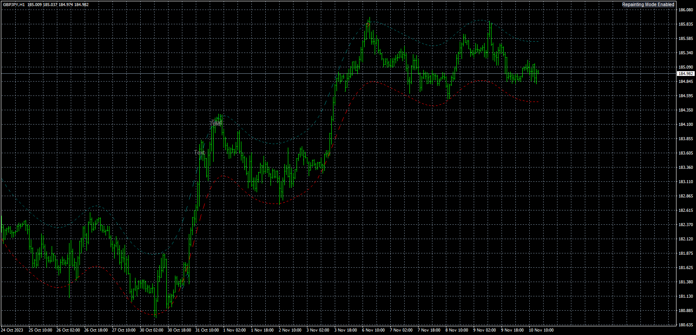

# Nadaraya-Watson_Envelope_[LuxAlgo]

> Source: https://fxcodebase.com/code/viewtopic.php?f=38&t=74624  
> Forum: 38 · Topic 74624 · 12 post(s)

---

## Nadaraya-Watson_Envelope_[LuxAlgo]

**Apprentice** · Sat Feb 17, 2024 8:47 am

Based on the request.
[https://fxcodebase.com/code/viewtopic.php?f=38&t=74120](https://fxcodebase.com/code/viewtopic.php?f=38&t=74120)

 [Nadaraya-Watson_Envelope_(LuxAlgo).mq4](files/154403/Nadaraya-Watson_Envelope_LuxAlgo.mq4)

---

## Re: Nadaraya-Watson_Envelope_[LuxAlgo]

**Apprentice** · Sat Feb 17, 2024 8:54 am

Please use v2 of the indicator, I had to send the object data to buffers.

 [Nadaraya-Watson_Envelope_(LuxAlgo)_v2.mq4](files/154405/Nadaraya-Watson_Envelope_LuxAlgo_v2.mq4)

 [NW_Envelope_EA_v1.00.mq4](files/154405/NW_Envelope_EA_v1.00.mq4)

---

## Re: Nadaraya-Watson_Envelope_[LuxAlgo]

**lukgoku** · Thu Feb 22, 2024 4:55 pm

No reply

---

## Re: Nadaraya-Watson_Envelope_[LuxAlgo]

**Apprentice** · Sat Feb 24, 2024 2:32 pm

We have added your request to the development list.
Development reference 177

---

## Re: Nadaraya-Watson_Envelope_[LuxAlgo]

**[email protected]** · Sun Feb 25, 2024 6:34 am

> **Apprentice wrote:**
> We have added your request to the development list.
> Development reference 177

Hi. Please provide this EA version for MT5 too. thanks in advance.

---

## Re: Nadaraya-Watson_Envelope_[LuxAlgo]

**lukgoku** · Thu Mar 14, 2024 9:22 am

> **Apprentice wrote:**
> We have added your request to the development list.
> Development reference 177

Hi , any news?

---

## Re: Nadaraya-Watson_Envelope_[LuxAlgo]

**jaguar1637** · Sun Apr 14, 2024 5:26 pm

very interesting

Does this EA a special feature to detect if the market is trending or not for this kind of strategy ?

---

## Re: Nadaraya-Watson_Envelope_[LuxAlgo]

**Apprentice** · Wed Jun 12, 2024 3:26 pm

We have added your request to the development list.
Development reference 496

---

## Re: Nadaraya-Watson_Envelope_[LuxAlgo]

**ninjaproject** · Mon Jun 17, 2024 9:31 am

> **Apprentice wrote:**
> Please use v2 of the indicator, I had to send the object data to buffers.
>
>
> Nadaraya-Watson_Envelope_[LuxAlgo]_v2.mq4
>
>
>
>
> NW_Envelope_EA_v1.00.mq4

Can you, please, provide the code for calculating the envelopes?
I can use any other Naradaya-Watson Estimator source code, but I can't figure out exactly how the envelopes are calculated in this code.
The plotting of OBJ_TREND is a bad idea.
This should be plotted by simple buffers, and if I get the formula for calculating the envelopes, I can create a simpler version which will be light.

---

## Re: Nadaraya-Watson_Envelope_[LuxAlgo]

**Apprentice** · Sun Jun 23, 2024 3:51 pm

Have you try to read the TradingView source?
[https://www.tradingview.com/script/Iko0 ... e-LuxAlgo/](https://www.tradingview.com/script/Iko0E2kL-Nadaraya-Watson-Envelope-LuxAlgo/)

---

## Re: Nadaraya-Watson_Envelope_[LuxAlgo]

**Apprentice** · Tue Jun 25, 2024 1:01 pm

Task 497

 [Nadaraya_Watson_Envelope.mq5](files/155920/Nadaraya_Watson_Envelope.mq5)

 [NW_EA.mq5](files/155920/NW_EA.mq5)

---

## Re: Nadaraya-Watson_Envelope_[LuxAlgo]

**Apprentice** · Sun Jul 27, 2025 12:55 pm

Task 177

 [Nadaraya-Watson_Envelope.mq4](files/160041/Nadaraya-Watson_Envelope.mq4)

 [NW_Envelope_EA_v1.10.mq4](files/160041/NW_Envelope_EA_v1.10.mq4)
