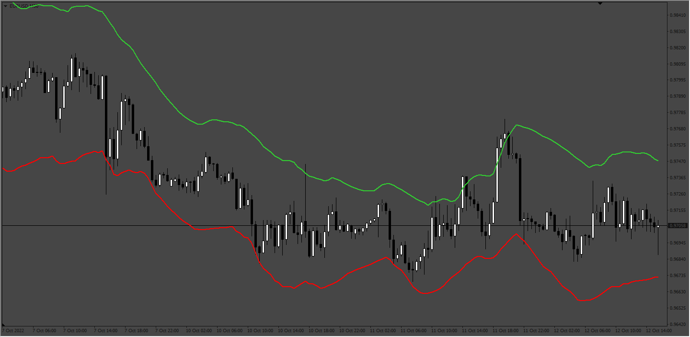
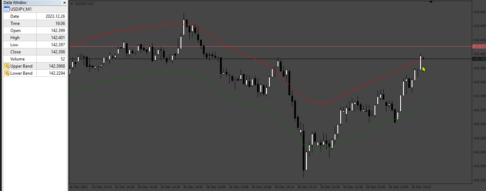

# NadarayaEnvelopes

> Source: https://fxcodebase.com/code/viewtopic.php?f=38&t=72847  
> Forum: 38 · Topic 72847 · 2 post(s)

---

## NadarayaEnvelopes

**Apprentice** · Tue Oct 18, 2022 1:20 am

Based on the Lua original.
[https://fxcodebase.com/code/viewtopic.php?f=17&p=147730](https://fxcodebase.com/code/viewtopic.php?f=17&p=147730)

 [NadarayaEnvelopes.mq4](files/147936/NadarayaEnvelopes.mq4)

Version with alert.
[https://fxcodebase.com/code/viewtopic.php?f=38&t=74508](https://fxcodebase.com/code/viewtopic.php?f=38&t=74508)

---

## Re: NadarayaEnvelopes

**Apprentice** · Thu Dec 28, 2023 5:14 am

 [Nadaraya_Envelope_V2.mq4](files/153823/Nadaraya_Envelope_V2.mq4)
