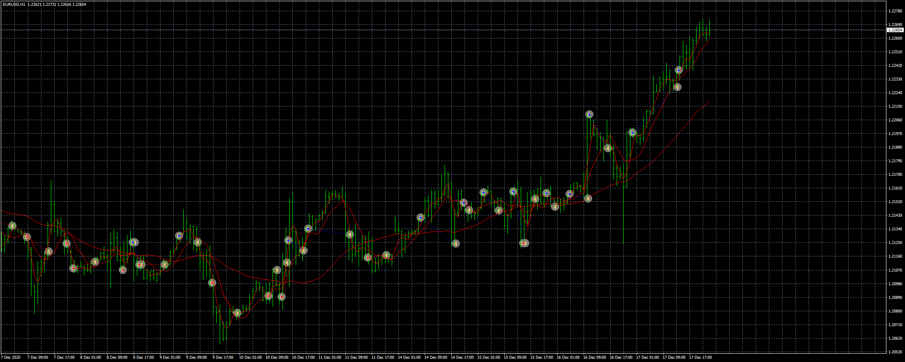
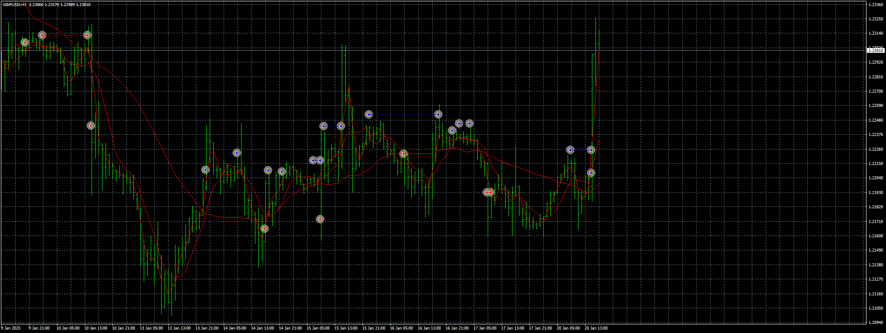

# Nagabangor EA1

> Source: https://fxcodebase.com/code/viewtopic.php?f=38&t=70883  
> Forum: 38 · Topic 70883 · 4 post(s)

---

## Nagabangor EA1

**Apprentice** · Thu Feb 04, 2021 8:40 am

Based on the request.
[viewtopic.php?f=27&t=70852](https://fxcodebase.com/code/viewtopic.php?f=27&t=70852)

 [Nagabangor EA1.mq4](files/140536/Nagabangor%20EA1.mq4)

 [Nagabangor EA2.mq4](files/140536/Nagabangor%20EA2.mq4)

---

## Re: Nagabangor EA1

**PhenomDC** · Thu Oct 27, 2022 5:01 pm

Hello Apprentice, hope you're doing well. Just tested this EA, please could you add the feature in which it doesn't execute trades instantly rather it places a pending order once signal shows up. Thanks bro

---

## Re: Nagabangor EA1

**Apprentice** · Sun Oct 30, 2022 4:20 am

We have added your request to the development list.
Development reference 688.

---

## Re: Nagabangor EA1

**Apprentice** · Mon Jan 20, 2025 10:29 am

 [Nagabangor_Pending_EA1.mq4](files/157903/Nagabangor_Pending_EA1.mq4)
