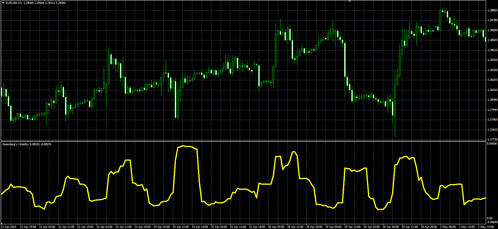

# Natenberg's Volatility

> Source: https://fxcodebase.com/code/viewtopic.php?f=38&t=61154  
> Forum: 38 · Topic 61154 · 1 post(s)

---

## Natenberg's Volatility

**Alexander.Gettinger** · Mon Sep 15, 2014 12:27 pm

Original LUA oscillator: [viewtopic.php?f=17&t=33104](https://fxcodebase.com/code/viewtopic.php?f=17&t=33104).

Formula:
NV = MVA(R), where
R[i] = Log(Close[i]/Close[i-1]),
Log - natural logarithm.

 

Download:

 [NV.mq4](files/95905/NV.mq4)
