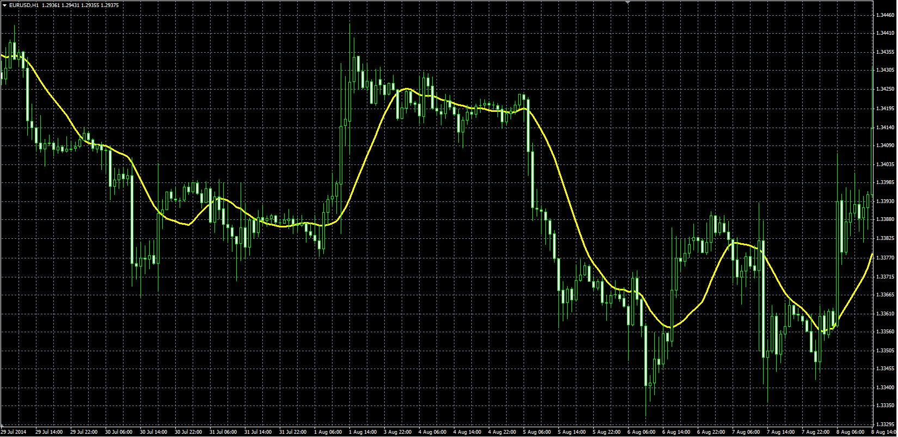

# Navel MA

> Source: https://fxcodebase.com/code/viewtopic.php?f=38&t=61141  
> Forum: 38 · Topic 61141 · 1 post(s)

---

## Navel MA

**Alexander.Gettinger** · Fri Sep 12, 2014 5:03 pm

Original LUA indicator: [viewtopic.php?f=17&t=37405](https://fxcodebase.com/code/viewtopic.php?f=17&t=37405).

Formula:
NMA = MA(P) with [Length] number of periods and [Method] type, where
P = (5*Close+2*Open+High+Low)/9.

 

Download:

 [NMA.mq4](files/95862/NMA.mq4)
