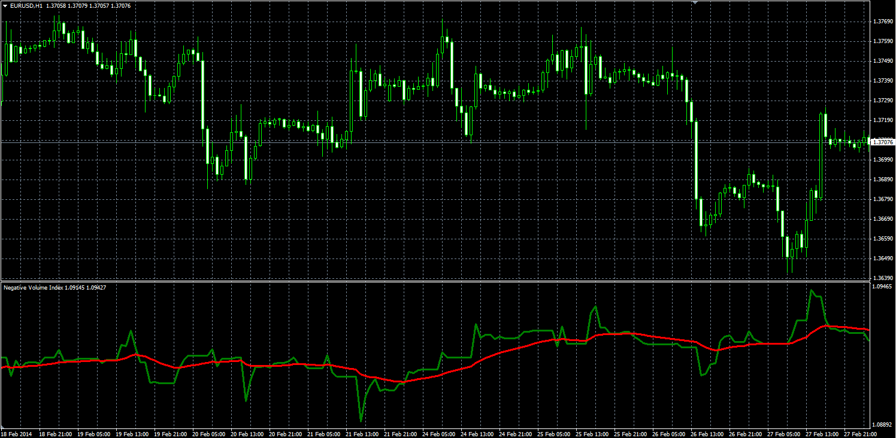

# Negative Volume Index

> Source: https://fxcodebase.com/code/viewtopic.php?f=38&t=60490  
> Forum: 38 · Topic 60490 · 1 post(s)

---

## Negative Volume Index

**Alexander.Gettinger** · Thu Apr 03, 2014 11:16 am

Original LUA oscillator: [viewtopic.php?f=17&t=9707&p=20701](https://fxcodebase.com/code/viewtopic.php?f=17&t=9707&p=20701).

 

Download:

 [NVI.mq4](files/93352/NVI.mq4)
