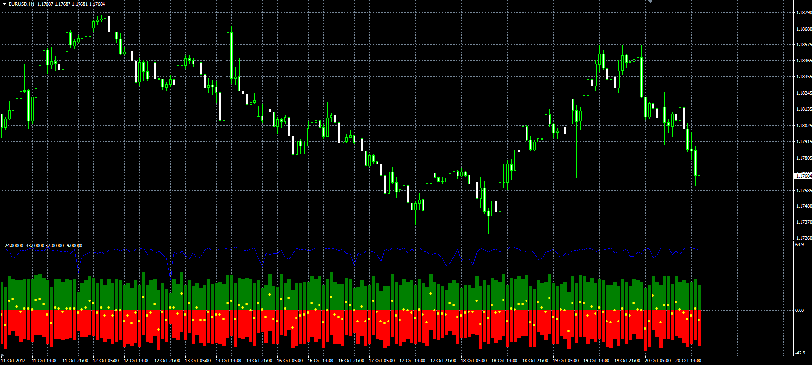
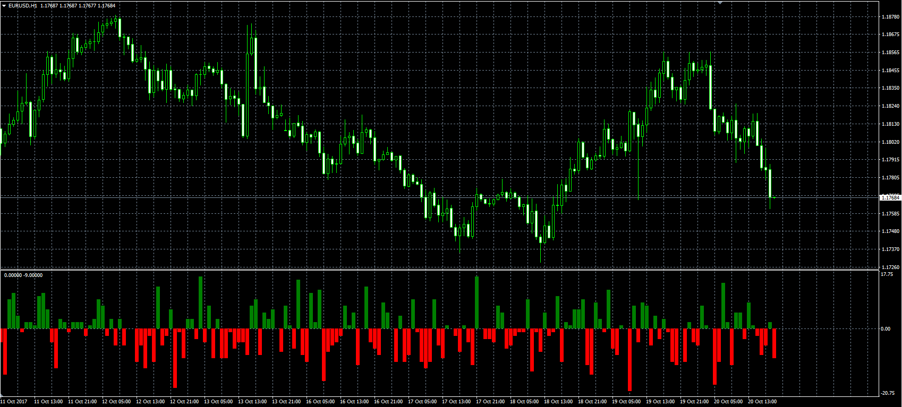
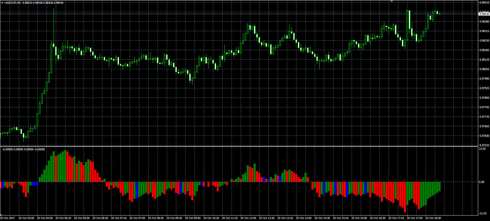

# Net Volume

> Source: https://fxcodebase.com/code/viewtopic.php?f=38&t=65190  
> Forum: 38 · Topic 65190 · 1 post(s)

---

## Net Volume

**Alexander.Gettinger** · Fri Oct 20, 2017 12:54 pm

Original LUA indicators: [viewtopic.php?f=17&t=61773](https://fxcodebase.com/code/viewtopic.php?f=17&t=61773).
**Net volume:**

 

Download:

 [Net_Volume.mq4](files/115529/Net_Volume.mq4)

**Net volume delta:**

 

Download:

 [Net_Volume_Delta.mq4](files/115529/Net_Volume_Delta.mq4)

**Net volume delta cumulative:**

 

Download:

 [Net_Volume_Delta_Cumulative.mq4](files/115529/Net_Volume_Delta_Cumulative.mq4)
