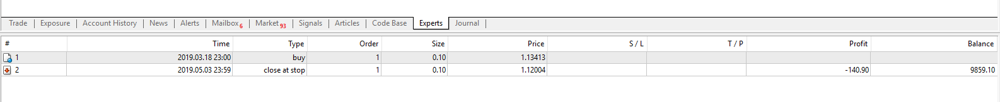

# neurotrend EA

> Source: https://fxcodebase.com/code/viewtopic.php?f=38&t=68669  
> Forum: 38 · Topic 68669 · 15 post(s)

---

## neurotrend EA

**Apprentice** · Mon Jul 15, 2019 7:44 am

[neurotrend.mq4](files/127358/neurotrend.mq4)

 [neurotrend EA.mq4](files/127358/neurotrend%20EA.mq4)

Based on request.
[viewtopic.php?f=27&t=68662](https://fxcodebase.com/code/viewtopic.php?f=27&t=68662)

---

## Re: neurotrend EA

**Sp2562** · Mon Jul 15, 2019 9:45 am

The backtest is not working.

Please sort it so I can backtest with EA.

---

## Re: neurotrend EA

**Apprentice** · Thu Jul 18, 2019 4:21 am

have no issues with backtesting

 

---

## Re: neurotrend EA

**Ludo69** · Thu Aug 01, 2019 11:05 am

Hi i would like to try neurotrend EA in this situation:

Scale Time = 15mn Currency is GBP/USD
When signal is detected and Blue = Buy 0.1 GBP/USD
When signal is detected and Red = Sell 0.1 GPB/USD

No Stop loss
No take Profit

Nothing else only signal i detected and action (buy or sell) is made.

---

## Re: neurotrend EA

**Sp2562** · Thu Aug 08, 2019 9:51 am

achieved great results with neurotrend

with the settings: stop gain 30 pips

but is holding orders

following picture:

---

## Re: neurotrend EA

**Sp2562** · Thu Aug 08, 2019 10:12 am

to solve the problems

I suggest moving average period 100

when the candles are above the average buy only (with next sale exit)

when candles are below average for sale only (with exit on next purchase)

following picture:

---

## Re: neurotrend EA

**Sp2562** · Thu Aug 08, 2019 3:53 pm

good morning my friend

I come here to share my feedback

in the image below we can see a good job

the only mistake is holding order too long (i need an ea scalper)

backtest configurations: take profit 30 pips M15

---

## Re: neurotrend EA

**Apprentice** · Mon Aug 12, 2019 6:23 am

Try this version.

 [neurotrend EA.mq4](files/127847/neurotrend%20EA.mq4)

---

## Re: neurotrend EA

**nookie** · Sat Aug 17, 2019 2:12 pm

Hello, what is the logic? Is there an article or some page where it explains what it is about ?

---

## Re: neurotrend EA

**Apprentice** · Sun Aug 18, 2019 8:12 am

All info I have is posted here.
[viewtopic.php?f=27&t=68662](https://fxcodebase.com/code/viewtopic.php?f=27&t=68662)

---

## Re: neurotrend EA

**Ludo69** · Fri May 29, 2020 12:13 am

Hi,

Do you think it's possible to make optional to, not only close in opposite signal, but close and open 1 new position corresponding to the oposite signal.

like this:
close on opposite signal ( Yes or Not )
and open a new position ( yes or Not )

ex:
1 Buy signal = open position
2 opposite signal = close the open position and open sell position
3 opposite signal = close the open position and open buy position
etc....
By this way we have always 1 placed order.

Regards

---

## Re: neurotrend EA

**Apprentice** · Fri May 29, 2020 4:25 am

Your request is added to the development list.
Development reference 1392.

---

## Re: neurotrend EA

**Apprentice** · Thu Jun 11, 2020 5:54 am

It already doing that.
 It always opens a position on the opposite signal. But the closing the opposite is optional.

---

## Re: neurotrend EA

**ankirulz** · Fri Jun 12, 2020 8:46 pm

I have tried to install Neurotrend EA on my Mt4 system and when I tried to run the EA, It says to install indicator neurotrend, Would you explain why and help to solve the issue.

Thanks

---

## Re: neurotrend EA

**Ludo69** · Sun Jun 14, 2020 11:03 am

Hi,
You have to install

Neurotrend EA.ex4 in Expert directory and Neurotrend.ex4 to Indocators Directory

and re start MT4 that all.
