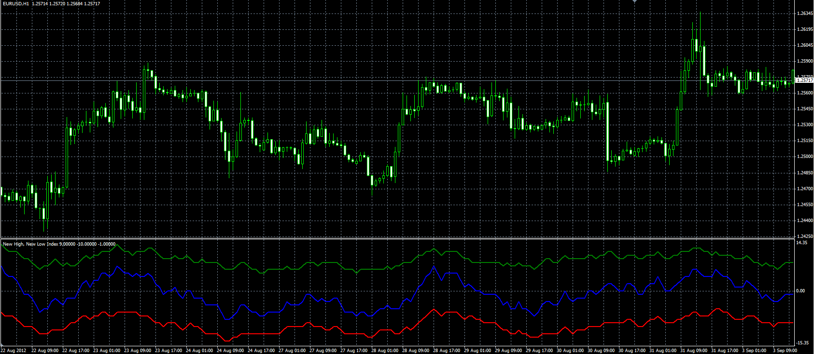

# New Highs New Lows Index

> Source: https://fxcodebase.com/code/viewtopic.php?f=38&t=23003  
> Forum: 38 · Topic 23003 · 2 post(s)

---

## New Highs New Lows Index

**Alexander.Gettinger** · Tue Sep 04, 2012 2:08 pm

Original indicator: [viewtopic.php?f=17&t=22579](https://fxcodebase.com/code/viewtopic.php?f=17&t=22579)

> Index is calculated as the difference between,
> number of higher highs in the period, and,
> number of lower lows in the period.

 

Download:

 [NHNL.mq4](files/39651/NHNL.mq4)

---

## Re: New Highs New Lows Index

**Alexander.Gettinger** · Thu Sep 06, 2012 3:10 pm

NHNL divergence indicator: [viewtopic.php?f=38&t=23088](https://fxcodebase.com/code/viewtopic.php?f=38&t=23088)
