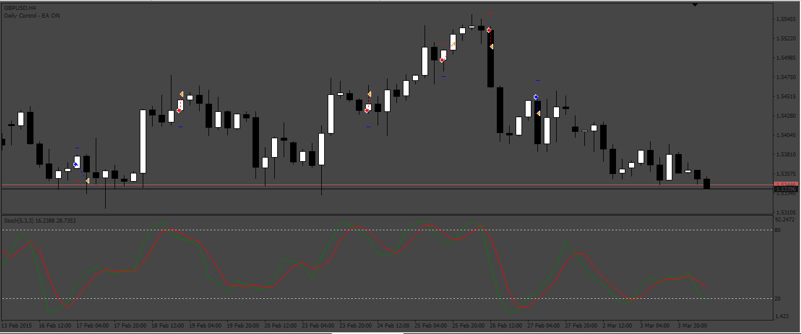

# New_Stochastic_EA

> Source: https://fxcodebase.com/code/viewtopic.php?f=38&t=73715  
> Forum: 38 · Topic 73715 · 4 post(s)

---

## New_Stochastic_EA

**Apprentice** · Sat May 13, 2023 10:34 am

Based on the request.
[https://fxcodebase.com/code/viewtopic.php?f=38&t=73694](https://fxcodebase.com/code/viewtopic.php?f=38&t=73694)

 [New_Stochastic_EA.mq4](files/150820/New_Stochastic_EA.mq4)

TS2 version
[https://fxcodebase.com/code/viewtopic.php?f=31&t=74035](https://fxcodebase.com/code/viewtopic.php?f=31&t=74035)

---

## Re: New_Stochastic_EA

**YOUYOUMA** · Sat Jun 10, 2023 4:13 pm

Bonjour,
Est ce possible d avoir vet EA en lua ? merciiiiiii

---

## Re: New_Stochastic_EA

**Apprentice** · Thu Jun 15, 2023 5:30 am

We have added your request to the development list.
Development reference 528.

---

## Re: New_Stochastic_EA

**Apprentice** · Tue Aug 15, 2023 12:18 pm

TS2 version
[https://fxcodebase.com/code/viewtopic.php?f=31&t=74035](https://fxcodebase.com/code/viewtopic.php?f=31&t=74035)
