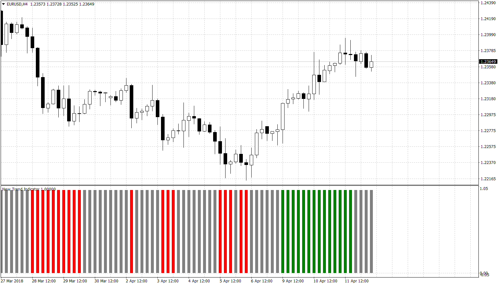

# New Trend Indicator

> Source: https://fxcodebase.com/code/viewtopic.php?f=38&t=65918  
> Forum: 38 · Topic 65918 · 5 post(s)

---

## New Trend Indicator

**Apprentice** · Thu Apr 12, 2018 5:49 am

Lua Original
[viewtopic.php?f=17&t=6596](https://fxcodebase.com/code/viewtopic.php?f=17&t=6596)

This indicator attempts to detect the emergence of a new trend.

Up Trend
Close> MVA + ATR

Down Trend
Close <MVA - ATR

Unspecified Trend - everything in between.

 [New Trend Indicator.MQ4](files/118617/New%20Trend%20Indicator.MQ4)

 [New Trend IndicatorAlert.MQ4](files/118617/New%20Trend%20IndicatorAlert.MQ4)

---

## Re: New Trend Indicator

**6-sycamor** · Mon Apr 23, 2018 8:47 am

Good day,

can you do it alarm, when line change color ? One time is enough.

This look very interested, drop on few pairs on m15, but alarm would be very useful.

Regards,

S.

---

## Re: New Trend Indicator

**Apprentice** · Mon Apr 23, 2018 11:26 am

Your request is added to the development list under Id Number 4121

---

## Re: New Trend Indicator

**Apprentice** · Thu Apr 26, 2018 6:08 am

New Trend IndicatorAlert added.

---

## Re: New Trend Indicator

**6-sycamor** · Fri Apr 27, 2018 8:13 am

Thank you very much

Regards,

S.
