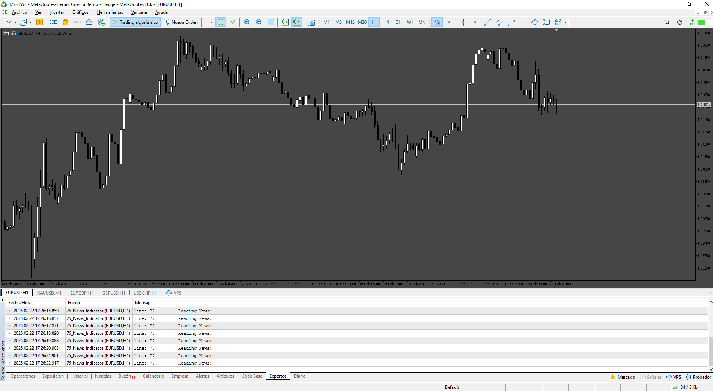

# NEWS_MT4

> Source: https://fxcodebase.com/code/viewtopic.php?f=38&t=74530  
> Forum: 38 · Topic 74530 · 33 post(s)

---

## NEWS_MT4

**Apprentice** · Sat Jan 13, 2024 3:06 pm

Based on the request.
[https://fxcodebase.com/code/viewtopic.php?f=27&p=153813](https://fxcodebase.com/code/viewtopic.php?f=27&p=153813)

 [NEWS_EA_v1.00.mq5](files/154029/NEWS_EA_v1.00.mq5)

 [NEWS_EA_v1.00.mq4](files/154029/NEWS_EA_v1.00.mq4)

---

## Re: NEWS_MT4

**rickCreations** · Mon Jan 15, 2024 12:07 am

Thank you very much boss? at the bottom of the mq4 it is very clear where to add this function ,
if one of the developers have any free time please also post the mq5 version of this since it will be helpful for developers of both mt4 and mt5 platform. thank you again.

---

## Re: NEWS_MT4

**Apprentice** · Sat Jan 20, 2024 4:47 am

We have added your request to the development list.
Development reference 91

---

## Re: NEWS_MT4

**rickCreations** · Sun Jan 21, 2024 1:58 am

> **Apprentice wrote:**
> We have added your request to the development list.
> Development reference 91

@Apprentice , after adding this to an EA if i backtest should the news feed be showing or not showing since i don't know if the stop news function works when backtesting. just a question .

---

## Re: NEWS_MT4

**Apprentice** · Thu Jan 25, 2024 5:42 pm

You can’t test the news stop in the tester, try in the demo account.

---

## Re: NEWS_MT4

**Apprentice** · Tue Feb 06, 2024 7:11 pm

Try it now.

---

## Re: NEWS_MT4

**stesuc** · Tue Feb 13, 2024 7:53 am

How to set EA on during News

---

## Re: NEWS_MT4

**Supervisor007** · Tue Mar 05, 2024 11:04 am

Can I put on web request in menu tools then options then Expert Advisors then nfs.faireconomy.media then uncheck DLL?

---

## Re: NEWS_MT4

**Apprentice** · Tue Mar 12, 2024 12:39 pm

Comments are inserted in the code.

 [NEWS_EA_v1.10.mq4](files/154663/NEWS_EA_v1.10.mq4)

 [NEWS_EA_v1.10.mq5](files/154663/NEWS_EA_v1.10.mq5)

---

## Re: NEWS_MT4

**stesuc** · Sat Mar 16, 2024 2:07 am

> **Apprentice wrote:**
> Comments are inserted in the code.
>
>
> NEWS_EA_v1.10.mq4
>
>
>
>
> NEWS_EA_v1.10.mq5

Can this EA be set ON during the news and stopped a few minutes after the news?

---

## Re: NEWS_MT4

**Apprentice** · Sat Mar 16, 2024 9:57 am

We have added your request to the development list.
Development reference 225

---

## Re: NEWS_MT4

**Apprentice** · Sun Mar 24, 2024 12:33 pm

Try this version.

 [NEWS_EA_v1.20.mq5](files/154805/NEWS_EA_v1.20.mq5)

 [NEWS_EA_v1.20.mq4](files/154805/NEWS_EA_v1.20.mq4)

---

## Re: NEWS_MT4

**stesuc** · Wed Jul 24, 2024 2:39 am

> **stesuc wrote:**
>
>
> > **Apprentice wrote:**
> > Comments are inserted in the code.
> >
> >
> > NEWS_EA_v1.10.mq4
> >
> >
> >
> >
> > NEWS_EA_v1.10.mq5
>
>
>
> Can this EA be set ON during the news and stopped a few minutes after the news?

 yes

---

## Re: NEWS_MT4

**RogerS** · Tue Sep 10, 2024 5:05 am

hi,
i've been trying both mt4 and mt5 versions,
and allthough the EA reads the news correctly, plots the vertical lines correctly,
and changes its state from "no news" to "news time"
it actually doesnt closes all open orders and pending orders,
after checking the code it says "insert here your close all function" but there are several ways to do that
is there any cance you could update the code and adding that close all current and pending orders function in mt4 and mt5?
also i have a question would it be compatible with forex factory news just changing the URL?
thank you.

---

## Re: NEWS_MT4

**RogerS** · Tue Sep 10, 2024 5:15 am

> **Apprentice wrote:**
> Try this version.
>
>
> NEWS_EA_v1.20.mq5
>
>
>
>
> NEWS_EA_v1.20.mq4

Hi,
i've been trying both mt4 and mt5 versions,
and despite the EA reads news correctly, plots vertical lines, and changes its state from "no news" to news time..." the orders are not getting closed,
is there any chance that function could be added to the code for open and pending orders?
also i have a question would the EA work for example with forexfactory news by just changing the URL?
thank you in advance

---

## Re: NEWS_MT4

**Apprentice** · Sat Sep 14, 2024 3:54 am

We have added your request to the development list.
Development reference 718

---

## Re: NEWS_MT4

**Apprentice** · Wed Sep 18, 2024 3:29 pm

[NEWS_EA_v1.30_CloseAll.mq5](files/156731/NEWS_EA_v1.30_CloseAll.mq5)

 [NEWS_EA_v1.30_CloseAll.mq4](files/156731/NEWS_EA_v1.30_CloseAll.mq4)

Try those.

---

## Re: NEWS_MT4

**angshsgsg** · Sat Oct 12, 2024 5:44 pm

Hi,
I want to ask if you could implement so it deactivates "Auto Trading" when the chosen News happens.
I also think a "Time Filter", included would be interesting.

Cordially,
Anton Gonzalez Sundewall

---

## Re: NEWS_MT4

**angshsgsg** · Sun Oct 13, 2024 7:19 am

> **Apprentice wrote:**
>
>
> NEWS_EA_v1.30_CloseAll.mq5
>
>
>
>
> NEWS_EA_v1.30_CloseAll.mq4
>
>
> Try those.

I want to know if you could implement it so it deactivates and activates “Auto Trading”, and a "Time Filter" into the EA.

---

## Re: NEWS_MT4

**angshsgsg** · Sun Oct 13, 2024 3:27 pm

> **Apprentice wrote:**
>
>
> The attachment **NEWS_EA_v1.30_CloseAll.mq5** is no longer available
>
>
>
>
> The attachment **NEWS_EA_v1.30_CloseAll.mq5** is no longer available
>
>
> Try those.

I would like to know if it is possible to implement so it deactivates and activates “Auto Trading”, and add a "Time Filter" into the EA.

At the bottom are some MQ4 and MQ5 files with the features I would like you to add to the main “News Filter” EA “NEWS_EA_v1.10”.

Link MQ4, and MQ5 Files:
[https://dropover.cloud/de6b44a8dededab0fcdc1ae268c6214d](https://dropover.cloud/de6b44a8dededab0fcdc1ae268c6214d)

---

## Re: NEWS_MT4

**Apprentice** · Thu Oct 17, 2024 5:13 pm

We have added your request to the development list.
Development reference 792

---

## Re: NEWS_MT4

**Apprentice** · Tue Oct 22, 2024 12:05 pm

[NEWS_EA_v1.40_CloseAll+TurnOff.mq5](files/157055/NEWS_EA_v1.40_CloseAllTurnOff.mq5)

 [NEWS_EA_v1.40_CloseAll+TurnOff.mq4](files/157055/NEWS_EA_v1.40_CloseAllTurnOff.mq4)

Try those.

---

## Re: NEWS_MT4

**simplex** · Wed Oct 30, 2024 5:33 am

Just registered, first post here ...

I downloaded both mql5 versions of this EA. In my opinion, it can't work as intended when used to close trades before news events.

func NewsTimer(bool nb) ALWAYS returns false.
In spite of that, in OnTick() trades will only be closed if NewsTimer() returns true.

---

## Re: NEWS_MT4

**Apprentice** · Thu Oct 31, 2024 8:24 am

We have added your request to the development list.
Development reference 802

---

## Re: NEWS_MT4

**simplex** · Sun Nov 03, 2024 3:30 pm

> **Apprentice wrote:**
> We have added your request to the development list. Development reference 802

Thanks a lot, but please do not consider my previous post a request. I do not intend to use this EA. While scanning the code the issue I reported caught my eye, and I had the idea that you might want to know.

Cheers, sx

---

## Re: NEWS_MT4

**Apprentice** · Sun Nov 10, 2024 2:27 pm

[NEWS_EA_v1.50_CloseAll%2BTurnOff.mq4](files/157219/NEWS_EA_v1.50_CloseAll2BTurnOff.mq4)

 [NEWS_EA_v1.50_CloseAll%2BTurnOff.mq5](files/157219/NEWS_EA_v1.50_CloseAll2BTurnOff.mq5)

---

## Re: NEWS_MT4

**pascal350** · Sun Jan 26, 2025 1:57 pm

Hello and thank you for this code.

Is it possible to have it as an indicator with buffers ?

I have found a MT5 version of FFC but the buffers doesn't work. I have spent a few days trying to solve the problem, but it still doesn't work.

I have a link with ForexFactory data as xml and csv from 2007 to now, and I would like to use this data with StrategyQuantX to develop EAs with news backtesting.

It's possible to export data from an MT5 indicators to StrategyQuantX but only with buffers, for backtesting, and for live trading the EA will collect data with iCustom function.

So I need two buffers: numbers of minutes between last closed bar and the next news, and impact of the next news (for example 1 low impact 2 medium impact 3 high impact).

If someone could help me it would be great

Thank you

[url]https://www.forexfactory.com/thread/549773-plot-news-downloader-version-400
[/url]
[https://www.forexfactory.com/thread/1311021-mql45-programmers-this-weekly-news-download-code-solves](https://www.forexfactory.com/thread/1311021-mql45-programmers-this-weekly-news-download-code-solves)
[url]https://www.forexfactory.com/attachment/file/4716060?d=1715647656
[/url]

---

## Re: NEWS_MT4

**Apprentice** · Sat Feb 01, 2025 4:48 pm

We have added your request to the development list.
Development reference 75

---

## Re: NEWS_MT4

**pascal350** · Sun Feb 02, 2025 2:02 pm

Thank you.

Where to find this list please ?

---

## Re: NEWS_MT4

**Apprentice** · Mon Feb 24, 2025 5:54 am

 [News_Indicator.mq5](files/158382/News_Indicator.mq5)

---

## Re: NEWS_MT4

**pascal350** · Mon Feb 24, 2025 12:03 pm

Thank you.

Can I have more expanations please ? I see two buffers, Line Indicator and Arrow Down, that's not what I've asked.

I need one buffer for next news in minutes, and one for impact please.

I have tried the indicator, it doesn't work, no news appears on the chart. And I need the indicator to work in both tester mode and live chart please.

---

## Re: NEWS_MT4

**pascal350** · Mon Feb 24, 2025 12:17 pm

the code is weird and doesn't work, I think it has mistakes.

---

## Re: NEWS_MT4

**Apprentice** · Tue Mar 04, 2025 5:54 am

We have added your request to the development list.
Development reference 164
