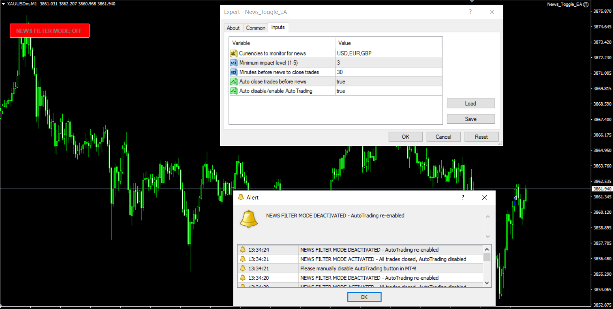
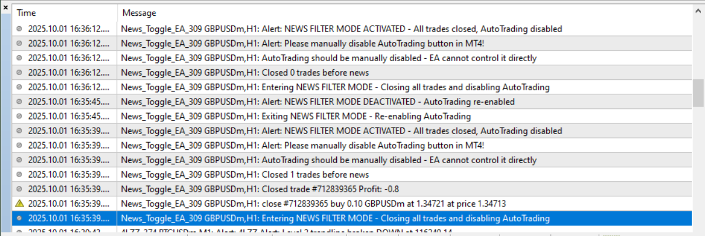

# News_Toggle_EA

> Source: https://fxcodebase.com/code/viewtopic.php?f=38&t=76342  
> Forum: 38 · Topic 76342 · 1 post(s)

---

## News_Toggle_EA

**Apprentice** · Thu Oct 02, 2025 4:45 am

 

Based on the request.
[https://fxcodebase.com/code/viewtopic.php?f=17&t=73590](https://fxcodebase.com/code/viewtopic.php?f=17&t=73590)
The EA will automatically close all trades before important news and send Alert for you to manually disable AutoTrading. After news, re-enable AutoTrading.
Reason: MT4 doesn't allow EA to automatically turn AutoTrading on/off, requires manual operation following Alert.

How to use:
When EA shows Alert, click AutoTrading button on MT4 to disable, after news then enable again. EA will automatically close trades and detect news from FXStreet - The Forex Market . EA still protects account effectively, just need simple manual operation following Alert

 [News_Toggle_EA.mq4](files/160718/News_Toggle_EA.mq4)
