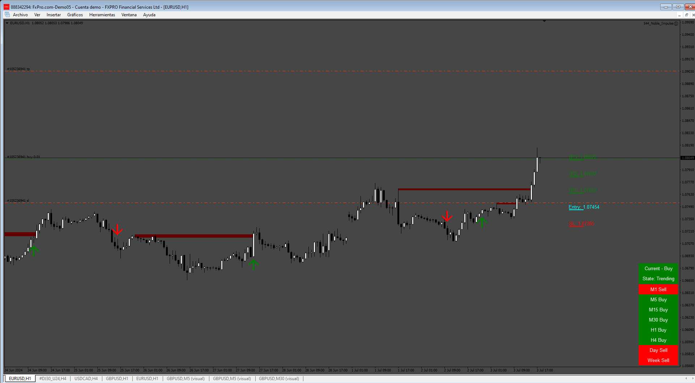

# Noble_Impulse_EA

> Source: https://fxcodebase.com/code/viewtopic.php?f=38&t=75031  
> Forum: 38 · Topic 75031 · 12 post(s)

---

## Noble_Impulse_EA

**Apprentice** · Fri Jul 05, 2024 3:42 am

Based on the request.
[https://fxcodebase.com/code/viewtopic.php?f=38&t=74998](https://fxcodebase.com/code/viewtopic.php?f=38&t=74998)

 [Noble Impulse V4 Licensed_fix_fix.ex4](files/156007/Noble%20Impulse%20V4%20Licensed_fix_fix.ex4)

 [Noble_Impulse_EA.mq4](files/156007/Noble_Impulse_EA.mq4)

---

## Re: Noble_Impulse_EA

**ZeroMenthol** · Mon Jul 08, 2024 4:20 am

the EA does not execute trades, only buy/sell alerts from indicator

---

## Re: Noble_Impulse_EA

**bigwomanrosie** · Mon Jul 08, 2024 2:21 pm

Seems pretty good for scalping. Can I have the mt5 version please.

---

## Re: Noble_Impulse_EA

**Apprentice** · Sat Jul 13, 2024 2:06 am

We have added your request to the development list.
Development reference 568

---

## Re: Noble_Impulse_EA

**bigwomanrosie** · Sat Sep 07, 2024 8:17 pm

Hi there, any update in this one?
Thanks in advance.

---

## Re: Noble_Impulse_EA

**javedshaikm** · Fri Feb 21, 2025 6:43 am

Could you please provide the mq4 version of this noble impulse indicator, I have requested the original author to enable buffers, however on several request he didn't provide it. It would be very helpful if you can give the source code.

---

## Re: Noble_Impulse_EA

**Apprentice** · Sat Feb 22, 2025 5:30 am

we can NOT read ex4 file.

---

## Re: Noble_Impulse_EA

**javedshaikm** · Sun Feb 23, 2025 1:00 am

Is it possible to create an ea based on entry, sl, tp1, tp2, tp3 signal values given by the indicator, this is my idea - very simple ea that opens trades based on the signals given by indicator and be able to select the time frame and tp values i.e. tp1 or tp2 or tp3.

---

## Re: Noble_Impulse_EA

**javedshaikm** · Mon Feb 24, 2025 10:16 am

> **Apprentice wrote:**
> indicator is Noble Impulse V4?

Yes, the indicator is Noble impulse V4

---

## Re: Noble_Impulse_EA

**javedshaikm** · Wed Feb 26, 2025 7:59 pm

Yes it is noble impulse v4 indicator

---

## Re: Noble_Impulse_EA

**Apprentice** · Tue Mar 04, 2025 5:41 am

We have added your request to the development list.
Development reference 155

---

## Re: Noble_Impulse_EA

**Apprentice** · Wed Apr 09, 2025 9:02 am

The attached indicator might not work with simple copy-paste.

It should be downloaded from the marketplace, then copied from the Market folder to the MQL4/Indicators folder — that way it’ll definitely work.

The indicator must be attached to the chart first, and only then can the EA be started. The indicator doesn't work in the tester, so the EA won't work there either.

 [Noble_Impulse_V4_Licensed_fix_fix.ex4](files/158901/Noble_Impulse_V4_Licensed_fix_fix.ex4)

 [Noble_Impulse_EA_v1.00.mq4](files/158901/Noble_Impulse_EA_v1.00.mq4)
