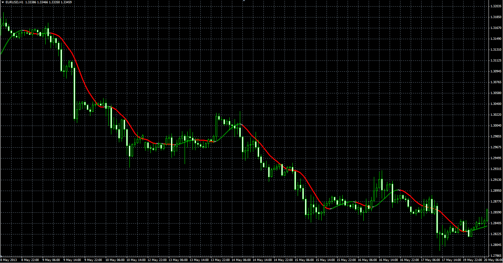
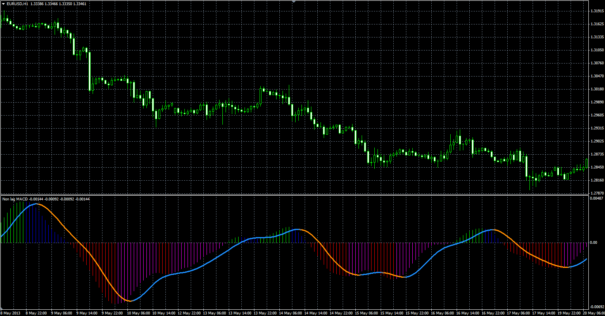

# Non lag average indicator and non lag MACD

> Source: https://fxcodebase.com/code/viewtopic.php?f=38&t=40966  
> Forum: 38 · Topic 40966 · 9 post(s)

---

## Non lag average indicator and non lag MACD

**Alexander.Gettinger** · Fri Jun 14, 2013 3:42 pm

Original LUA indicators: [viewtopic.php?f=17&t=1721](https://fxcodebase.com/code/viewtopic.php?f=17&t=1721)

**NonLag indicator:**

 

Download:

 [NonLag.mq4](files/67060/NonLag.mq4)

**NonLag MACD:**

 

Download:

 [NonLag_MACD.mq4](files/67060/NonLag_MACD.mq4)

For this indicator must be installed NonLag indicator.

---

## Re: Non lag average indicator and non lag MACD

**briansummy** · Wed Feb 01, 2017 10:32 pm

Can you make a Non lag dot Width indicator just like Bollinger Band Width just using non lag dot? This is really helping me with my live MT4 account.

---

## Re: Non lag average indicator and non lag MACD

**Apprentice** · Thu Feb 02, 2017 3:18 pm

Non lag dot Width is calculated as difference between Non lag and price?

---

## Re: Non lag average indicator and non lag MACD

**jacklrfx** · Mon Jul 24, 2017 10:09 am

> **Alexander.Gettinger wrote:**
> Original LUA indicators: [http://fxcodebase.com/code/viewtopic.php?f=17&t=1721](https://fxcodebase.com/code/viewtopic.php?f=17&t=1721)
>
> **NonLag indicator:**
>
>
>
> NonLag_MQL.PNG
>
>
>
> Download:
>
>
> NonLag.mq4

Hi,
Is this "NonLag indicator" repainting? (NonLag.mq4)
Thanks

---

## Re: Non lag average indicator and non lag MACD

**Alexander.Gettinger** · Wed Aug 02, 2017 12:23 pm

> Is this "NonLag indicator" repainting? (NonLag.mq4)

No.

---

## Re: Non lag average indicator and non lag MACD

**planstyr** · Sat Oct 05, 2019 12:58 am

> **Alexander.Gettinger wrote:**
>
>
> > Is this "NonLag indicator" repainting? (NonLag.mq4)
>
>
> No.

Do you know if this nonlag_macd repaint?

---

## Re: Non lag average indicator and non lag MACD

**Apprentice** · Wed Oct 09, 2019 11:01 am

No, as far as I know.

---

## Re: Non lag average indicator and non lag MACD

**trillionairemac** · Wed Oct 09, 2019 5:08 pm

Is there a strategy that goes along with these indicators? and if so, what are the rules? Could this be turned into an automated trader?

Kind regards,

Mac

---

## Re: Non lag average indicator and non lag MACD

**Apprentice** · Thu Oct 10, 2019 12:27 pm

Not that I know.
Can you provide EA rules?
