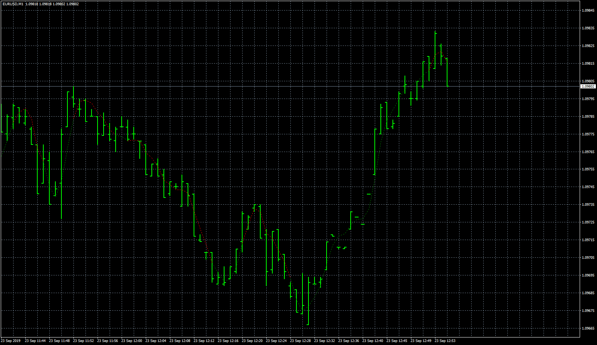

# NonLagDot

> Source: https://fxcodebase.com/code/viewtopic.php?f=38&t=69002  
> Forum: 38 · Topic 69002 · 3 post(s)

---

## NonLagDot

**Apprentice** · Thu Oct 10, 2019 12:42 pm

TS2/Lua version.
[viewtopic.php?f=17&t=1721](https://fxcodebase.com/code/viewtopic.php?f=17&t=1721)

 [NonLagDot.mq4](files/129119/NonLagDot.mq4)

---

## Re: NonLagDot

**planstyr** · Thu Oct 10, 2019 12:57 pm

> **Apprentice wrote:**
>
>
> eurusd-m1-fxcm-australia-pty.png
>
>
> TS2/Lua version.
> [viewtopic.php?f=17&t=1721](https://fxcodebase.com/code/viewtopic.php?f=17&t=1721)
>
>
> NonLagDot.mq4

Thank you very much.

---

## Re: NonLagDot

**dsforexsignals** · Thu Nov 14, 2019 3:28 pm

This indicator repaints.
