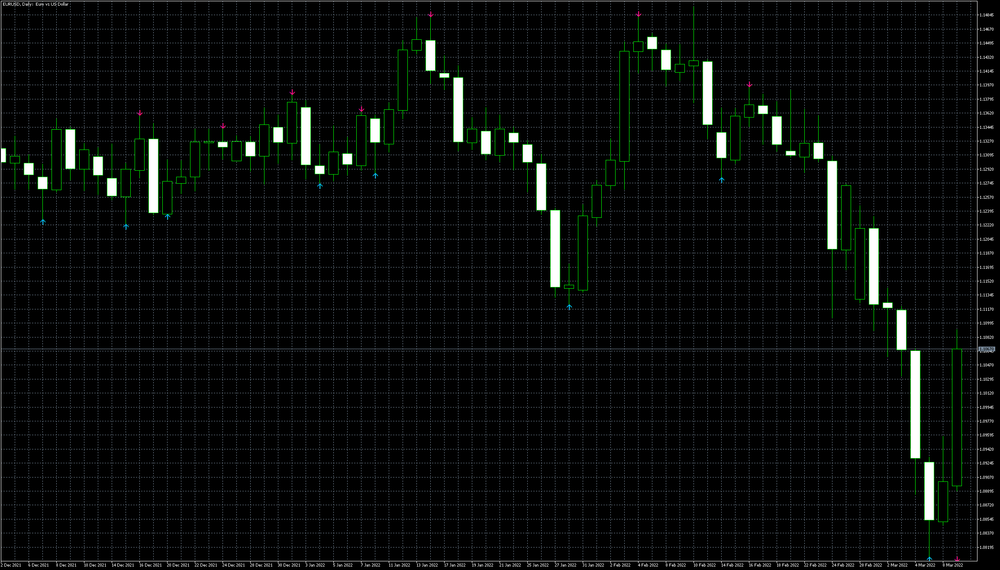

# NoRepaint

> Source: https://fxcodebase.com/code/viewtopic.php?f=38&t=71948  
> Forum: 38 · Topic 71948 · 4 post(s)

---

## NoRepaint

**Apprentice** · Wed Mar 09, 2022 12:11 pm

Based on the request.
[https://fxcodebase.com/code/viewtopic.php?f=27&p=145159](https://fxcodebase.com/code/viewtopic.php?f=27&p=145159)

 [NoRepaint.mq5](files/145276/NoRepaint.mq5)

 [NOREPAINT_Trend_Alerts.mq4](files/145276/NOREPAINT_Trend_Alerts.mq4)

---

## Re: NoRepaint

**forextraderaz** · Thu Mar 10, 2022 12:14 pm

Hello,

Can you add alert to the indicator? Thanks

---

## Re: NoRepaint

**Apprentice** · Fri Mar 11, 2022 3:24 am

Your request is added to the development list.
Development reference 152.

---

## Re: NoRepaint

**Apprentice** · Wed Mar 16, 2022 11:53 am

[NoRepaint_alert.mq5](files/145369/NoRepaint_alert.mq5)

Try this version.
