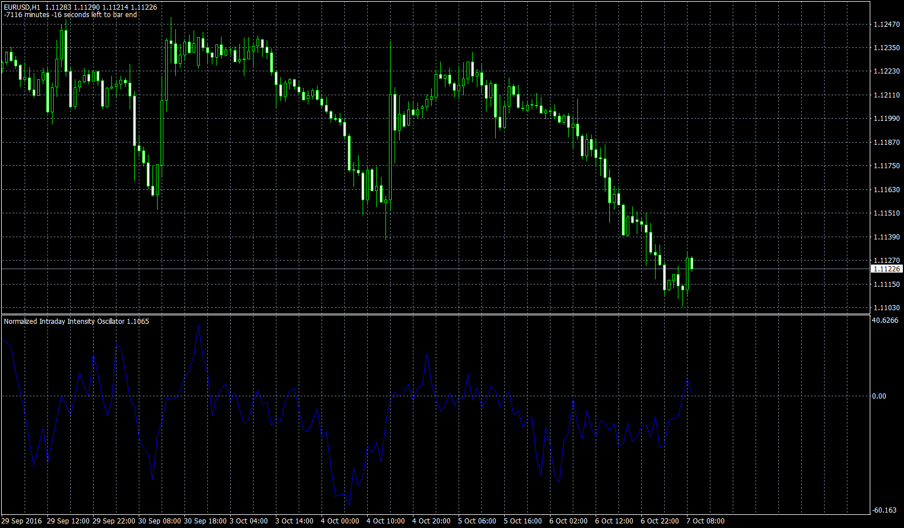

# Normalized Intraday Intensity Oscillator

> Source: https://fxcodebase.com/code/viewtopic.php?f=38&t=63979  
> Forum: 38 · Topic 63979 · 4 post(s)

---

## Normalized Intraday Intensity Oscillator

**Apprentice** · Sat Oct 15, 2016 8:23 am

Based on the request.
[viewtopic.php?f=27&t=63971](https://fxcodebase.com/code/viewtopic.php?f=27&t=63971)

 [Normalized Intraday Intensity Oscillator.mq4](files/108609/Normalized%20Intraday%20Intensity%20Oscillator.mq4)

 [Normalized Intraday Intensity Oscillator Histogram.mq4](files/108609/Normalized%20Intraday%20Intensity%20Oscillator%20Histogram.mq4)

TS2/Marketscope version.
[viewtopic.php?f=17&t=63978&p=108608#p108608](https://fxcodebase.com/code/viewtopic.php?f=17&t=63978&p=108608#p108608)

---

## Re: Normalized Intraday Intensity Oscillator

**striker593** · Mon Oct 17, 2016 6:38 am

thank you so much, this is amazing.
the only thing i would like to ask is: Is it possible to plot it as a histogram? this would be perfect.
great work, thank you so much!

---

## Re: Normalized Intraday Intensity Oscillator

**Apprentice** · Tue Oct 18, 2016 6:16 am

Histogram version added.

---

## Re: Normalized Intraday Intensity Oscillator

**striker593** · Wed Oct 19, 2016 11:05 am

thank you so much!
