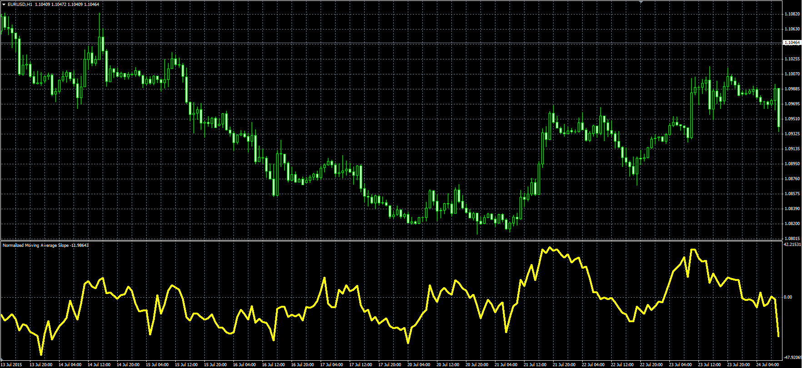

# Normalized Moving Average Slope

> Source: https://fxcodebase.com/code/viewtopic.php?f=38&t=62481  
> Forum: 38 · Topic 62481 · 1 post(s)

---

## Normalized Moving Average Slope

**Alexander.Gettinger** · Wed Jul 29, 2015 7:26 am

Original LUA oscillator: [viewtopic.php?f=17&t=62272](http://www.fxcodebase.com/code/viewtopic.php?f=17&t=62272).

Formula:
NMAS[i] = 100*(MA[i]-MA[i-1])/ATR, where
MA - moving average with [MA_Length] number of periods and [MA_Method] type,
ATR - average true range with [ATR_Length] number of periods.

 

Download:

 [Normalized_Moving_Average_Slope.mq4](files/101583/Normalized_Moving_Average_Slope.mq4)
