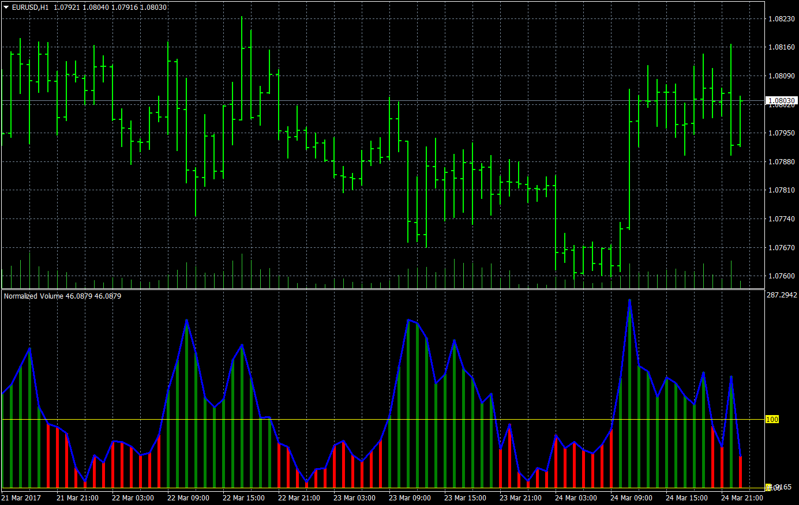

# Normalized Volume

> Source: https://fxcodebase.com/code/viewtopic.php?f=38&t=64548  
> Forum: 38 · Topic 64548 · 1 post(s)

---

## Normalized Volume

**Apprentice** · Sun Mar 26, 2017 7:11 am

Lua original.
[viewtopic.php?f=17&t=64543](https://fxcodebase.com/code/viewtopic.php?f=17&t=64543)

Normalized Volume is (Volume/Ma of Volume )*100

 [Normalized Volume.mq4](files/111691/Normalized%20Volume.mq4)
