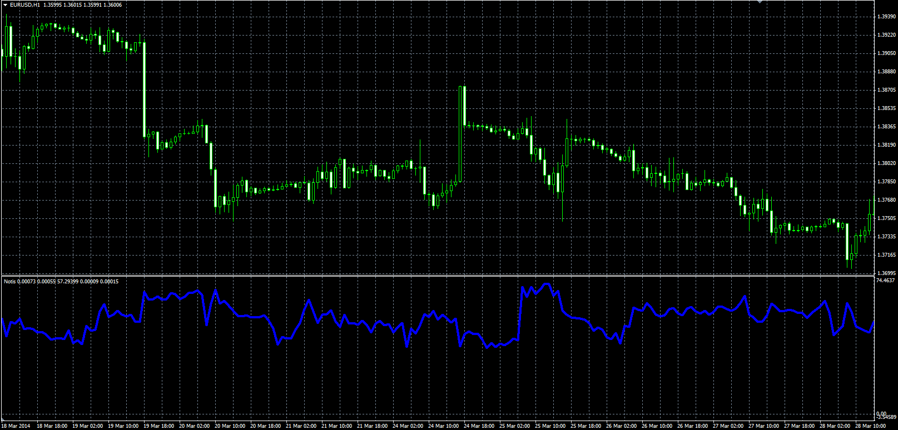

# NOTIS% V

> Source: https://fxcodebase.com/code/viewtopic.php?f=38&t=60763  
> Forum: 38 · Topic 60763 · 2 post(s)

---

## NOTIS% V

**Alexander.Gettinger** · Mon Jun 02, 2014 5:10 pm

Original LUA oscillator: [viewtopic.php?f=17&t=60533](https://fxcodebase.com/code/viewtopic.php?f=17&t=60533).

Formula:
NOTIS[i] = 100*Plus[i]/(Plus[i]+Minus[i]), where
Plus = Moving Average(P, Length, Method),
Minus = Moving average(M, Length, Method),
P[i] = High[i]-Close[i],
M[i] = Close[i]-Low[i].

 

Download:

 [Notis.mq4](files/94283/Notis.mq4)

---

## Re: NOTIS% V

**Apprentice** · Tue Jul 08, 2014 3:42 am

Inverse parameter is added to the cumulative.
