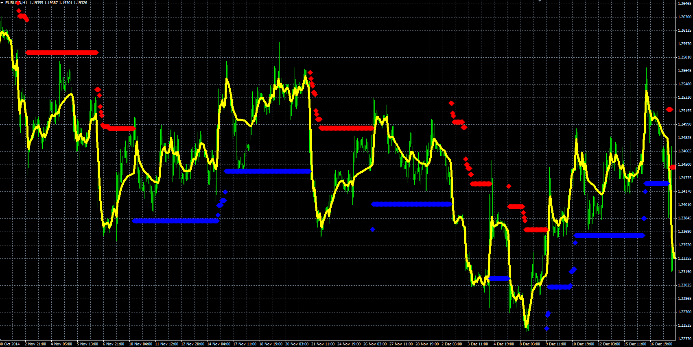

# NRMA indicator

> Source: https://fxcodebase.com/code/viewtopic.php?f=38&t=61693  
> Forum: 38 · Topic 61693 · 1 post(s)

---

## NRMA indicator

**Alexander.Gettinger** · Thu Jan 08, 2015 5:03 pm

NRMA is the famous indicator by Konstantin Kopyrkin, it produced numerous realizations of the indicator NRTR. In this variant we see a moving average (line) and trailing stops NRTR (points).

 

Download:

 [NRMA.mq4](files/98057/NRMA.mq4)
