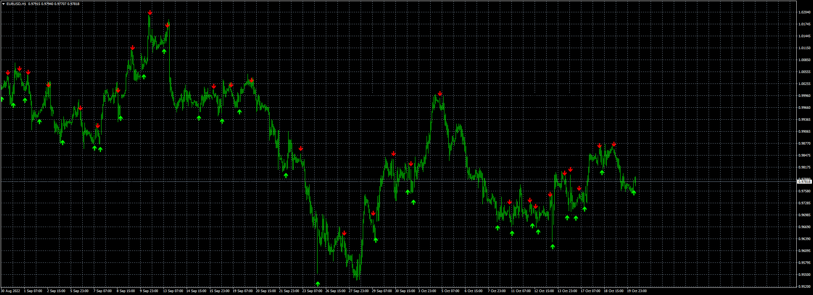
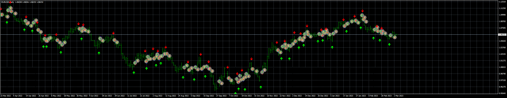

# NRP_Indicator_(with_Push)

> Source: https://fxcodebase.com/code/viewtopic.php?f=38&t=72857  
> Forum: 38 · Topic 72857 · 4 post(s)

---

## NRP_Indicator_(with_Push)

**Apprentice** · Thu Oct 20, 2022 2:31 am

Based on the request.
[https://fxcodebase.com/code/viewtopic.php?f=17&t=72816](https://fxcodebase.com/code/viewtopic.php?f=17&t=72816)
I made an option to switch off the "potential buy" and "potential sell" arrows,
which make confusion.

 [NRP_Indicator_(with_Push).mq4](files/147980/NRP_Indicator_%28with_Push%29.mq4)

---

## Re: NRP_Indicator_(with_Push)

**henrymutiso** · Thu Feb 23, 2023 5:14 am

Hi Apprentice,

This is a good MTF indicator. Is it possible to generate an EA for it? The buy and sell arrows are great when one takes them with a direction bias.
Kindly consider.

---

## Re: NRP_Indicator_(with_Push)

**Apprentice** · Tue Feb 28, 2023 4:22 am

We have added your request to the development list.
Development reference 195.

---

## Re: NRP_Indicator_(with_Push)

**Apprentice** · Sun Mar 05, 2023 5:27 pm

 [NRP_Indicator_for_EA.mq4](files/149867/NRP_Indicator_for_EA.mq4)

I had to edit the indicator to show buffers for EA. The EA works with the attached indicator only.

 [NRP_EA_v1.00.mq4](files/149867/NRP_EA_v1.00.mq4)
