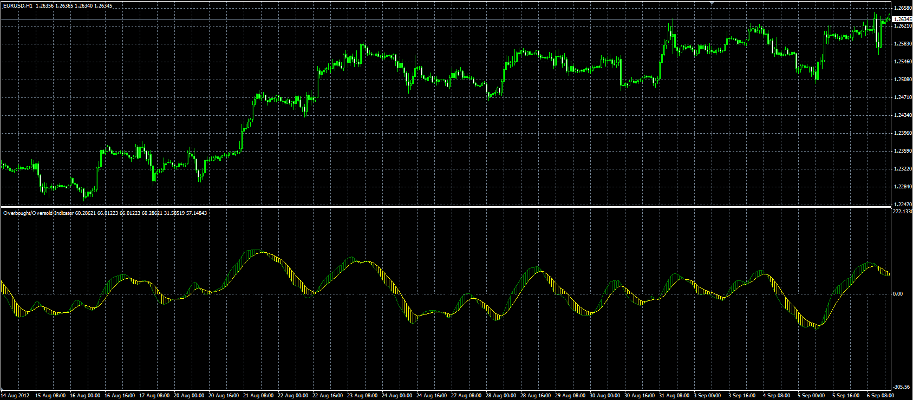

# OBOS indicator

> Source: https://fxcodebase.com/code/viewtopic.php?f=38&t=23087  
> Forum: 38 · Topic 23087 · 2 post(s)

---

## OBOS indicator

**Alexander.Gettinger** · Thu Sep 06, 2012 3:06 pm

Original indicator: [viewtopic.php?f=17&t=3664](https://fxcodebase.com/code/viewtopic.php?f=17&t=3664)

Formulas:
Up=EMA(EMA((WP-EMA(WP))/StdDev(WP))),
Dn=EMA(Up), where
EMA - exponential moving average with period [Length],
StdDev - standard deviation with period [Length],
WP - weighted price ((high+low+close+close)/4).

 

Download:

 [OBOS.mq4](files/39787/OBOS.mq4)

---

## Re: OBOS indicator

**Apprentice** · Wed Jan 24, 2018 8:40 am

Major update.
