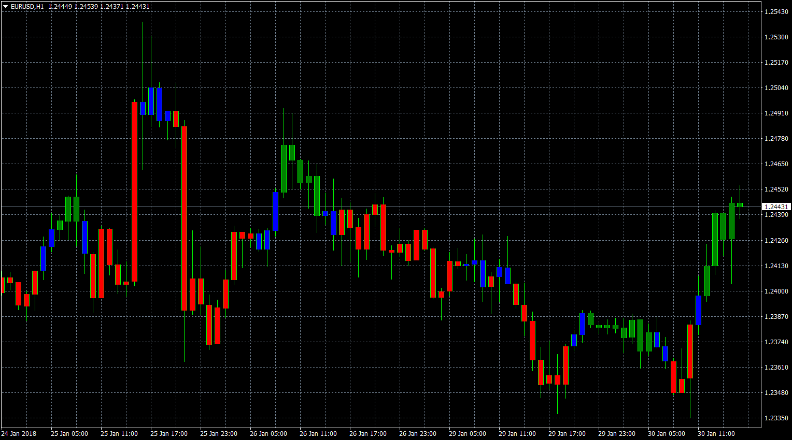

# OBOS Overlay with Alert

> Source: https://fxcodebase.com/code/viewtopic.php?f=38&t=65682  
> Forum: 38 · Topic 65682 · 4 post(s)

---

## OBOS Overlay with Alert

**Apprentice** · Tue Jan 30, 2018 11:39 am

Based on the original
[viewtopic.php?f=17&t=3664](http://www.fxcodebase.com/code/viewtopic.php?f=17&t=3664)

 [OBOS Overlay with Alert.mq4](files/117354/OBOS%20Overlay%20with%20Alert.mq4)

---

## Re: OBOS Overlay with Alert

**standup** · Wed Feb 07, 2018 7:01 am

The newest update of "OBOS Overlay with Alert.mq4",has some wrong alert just like that:
1.when the candle is finished, if the"BLUE" change to "GREEN",it give alert.
but when the candle is finished, if the"GREEN" change to "GREEN",it also give alert.
2.when the candle is finished, if the"BLUE" change to "RED,it give alert.
but when the candle is finished, if the"RED" change to "RED",it also give alert.
can you update it like that:
1.when the candle is finished, if the"BLUE" change to "GREEN",it give alert.
but when the candle is finished, if the"GREEN" change to "GREEN",it doesn't give alert.
2.when the candle is finished, if the"BLUE" change to "RED,it give alert.
but when the candle is finished, if the"RED" change to "RED",it doesn't give alert.

The newest update of "OBOS Overlay with Alert.mq4",has another wrong alert just like that:
Whenever "buy" or"sell",lt aways shows that" Oversold",but can't shows "Overbought",and can't show the symbol().
I think the "string alert_Body = "OBOS on " + Symbol() + "/" + tf + ": " + direction == 1 ? "Overbought" : "Oversold"; " is wrong,but i don't know how to modify?

---

## Re: OBOS Overlay with Alert

**Apprentice** · Thu Feb 08, 2018 6:35 am

Your request is added to the development list under Id Number 4043

---

## Re: OBOS Overlay with Alert

**Apprentice** · Fri Feb 09, 2018 6:50 am

Try it now.
