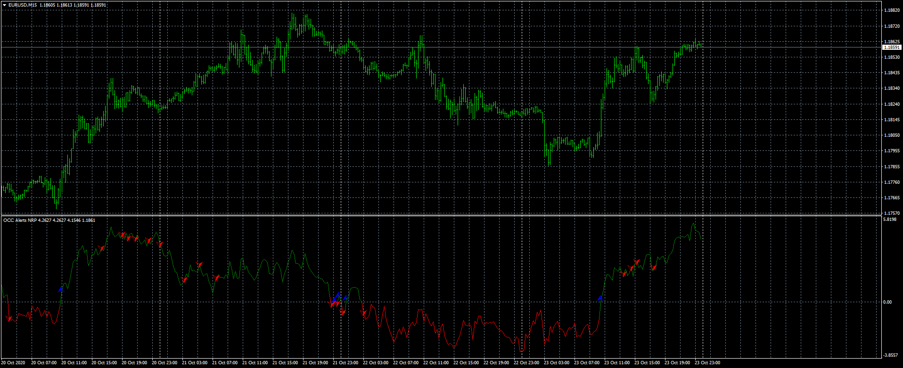

# OCC Alerts NRP

> Source: https://fxcodebase.com/code/viewtopic.php?f=38&t=70560  
> Forum: 38 · Topic 70560 · 4 post(s)

---

## OCC Alerts NRP

**Apprentice** · Sun Oct 25, 2020 9:18 am

Based on request.
[viewtopic.php?f=27&t=70553](https://fxcodebase.com/code/viewtopic.php?f=27&t=70553)

 [OCC Alerts NRP.mq4](files/138442/OCC%20Alerts%20NRP.mq4)

---

## Re: OCC Alerts NRP

**sino2361992** · Sat Dec 10, 2022 2:44 pm

Dear Mr. apprentice,

Can you please do these changes to the indicator:

Make it EA to Execute buy and sell signals when the lines
below turn green it open buy signal immediately and when it turns red it close the buy and open sell
as shown in this picture. and place fix the location of the arrows when it's buy it shows Green arrow up and when it's sell it shows Red arrow down on the chart.

Thank you so much for your efforts. you are an amazing person.
I will support you forever.

Best Regards,
Sinan

---

## Re: OCC Alerts NRP

**Apprentice** · Sun Dec 11, 2022 1:00 pm

We have added your request to the development list.
Development reference 820.

---

## Re: OCC Alerts NRP

**Apprentice** · Thu Oct 17, 2024 6:48 pm

Try this version.
[https://fxcodebase.com/code/viewtopic.p ... 26#p157026](https://fxcodebase.com/code/viewtopic.php?f=38&t=75290&p=157026#p157026)
