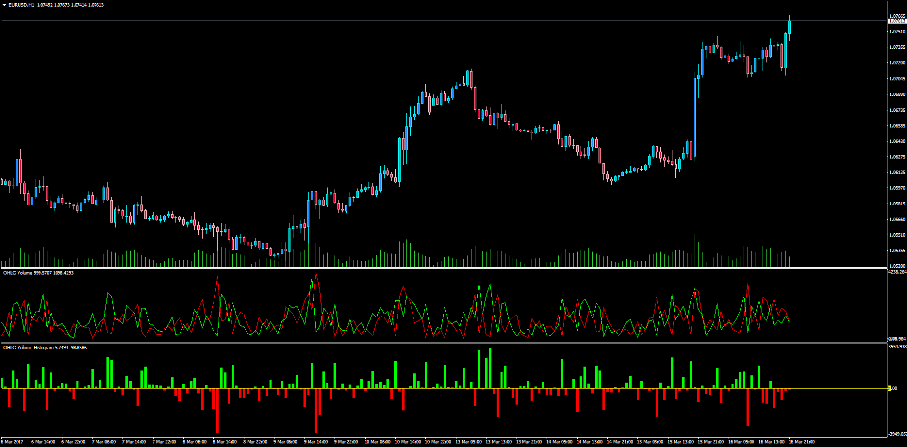

# OHLC Volume

> Source: https://fxcodebase.com/code/viewtopic.php?f=38&t=64529  
> Forum: 38 · Topic 64529 · 1 post(s)

---

## OHLC Volume

**Apprentice** · Thu Mar 16, 2017 5:02 pm

LUA Original: [viewtopic.php?f=17&t=3611](https://fxcodebase.com/code/viewtopic.php?f=17&t=3611)

Description:

This indicator is the MT4 version of the LUA original which separates the volume in correspondence to the open, close, high and low values of each bar.

Formulas used:

UP volume=Volume*UP_Coeff/(UP_Coeff+DN_Coeff),
DN volume=Volume*DN_Coeff/(UP_Coeff+DN_Coeff), where
UP_Coeff=High-Open,
DN_Coeff=Close-Low.

Also included the Histogram showing the difference between Up and Down volumes. When the Up is higher than the Down then the histogram is green with the difference between both volumes. Conversaly red when the down is greater than upper.

 [OHLC_Volume.mq4](files/111508/OHLC_Volume.mq4)

 [OHLC_Volume_Histo.mq4](files/111508/OHLC_Volume_Histo.mq4)
