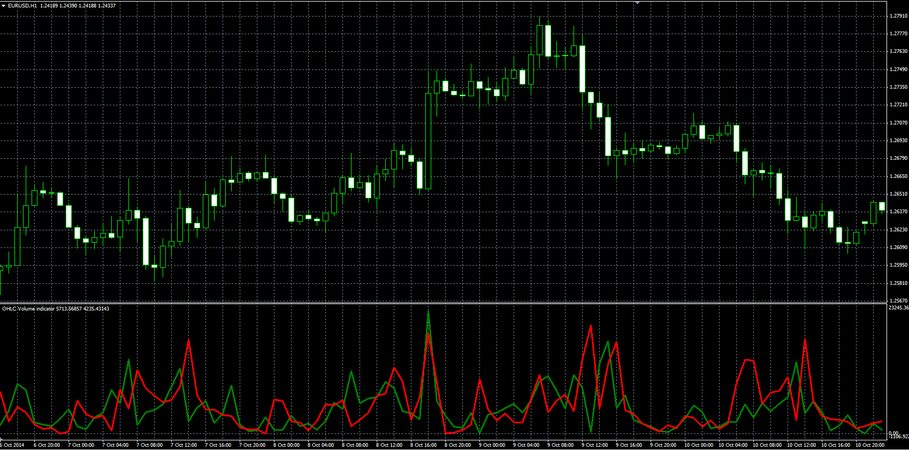
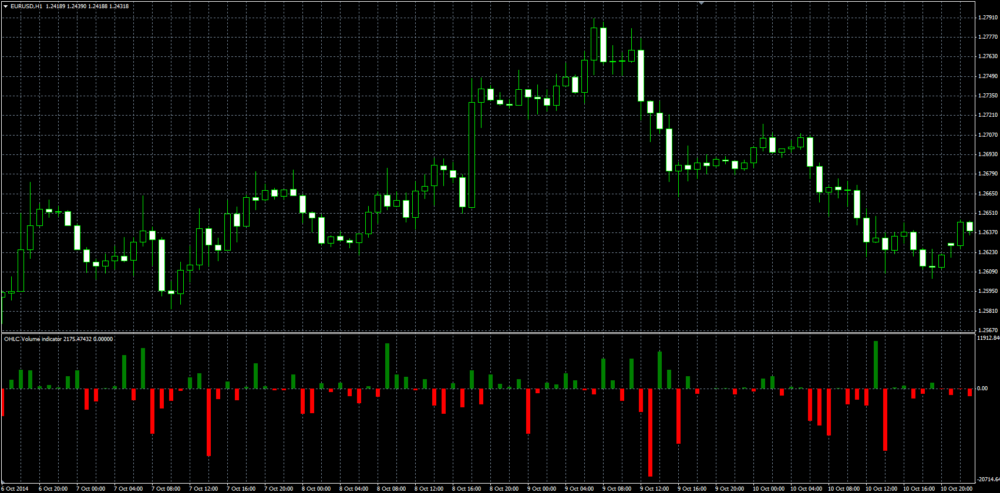

# OHLC Volume

> Source: https://fxcodebase.com/code/viewtopic.php?f=38&t=61552  
> Forum: 38 · Topic 61552 · 1 post(s)

---

## OHLC Volume

**Alexander.Gettinger** · Wed Nov 26, 2014 3:28 pm

The indicator separate volume in correspondence to open, close, high and low values of bar.

Formulas:
UP volume = Volume*UP_Coeff/(UP_Coeff+DN_Coeff),
DN volume = Volume*DN_Coeff/(UP_Coeff+DN_Coeff), where
UP_Coeff = High-Open,
DN_Coeff = Close-Low.

 

Download:

 [OHLC_Volume.mq4](files/97399/OHLC_Volume.mq4)

Histogram shows difference between UP and DN volume form previous indicator.

 

Download:

 [OHLC_Volume2.mq4](files/97399/OHLC_Volume2.mq4)
