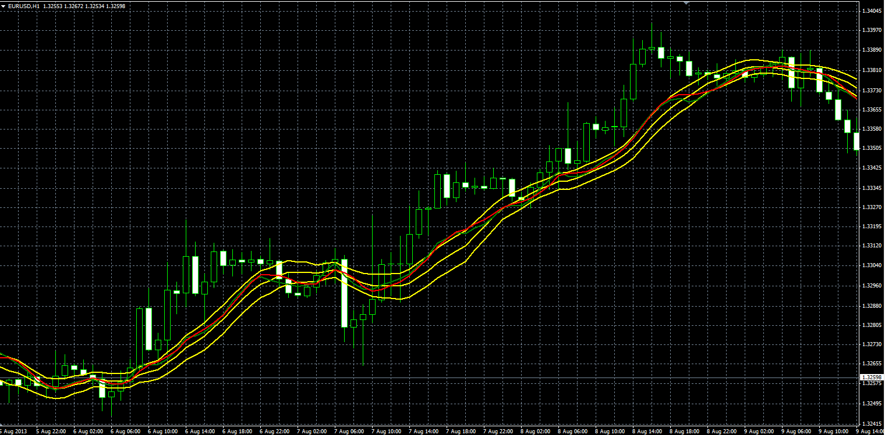

# OnChart Stochastic

> Source: https://fxcodebase.com/code/viewtopic.php?f=38&t=59120  
> Forum: 38 · Topic 59120 · 1 post(s)

---

## OnChart Stochastic

**Alexander.Gettinger** · Wed Aug 14, 2013 2:33 pm

Original LUA indicator: [http://fxcodebase.com/code/viewtopic.php?f=17&t=41814](https://fxcodebase.com/code/viewtopic.php?f=17&t=41814).

Formulas:
Central[i] = Moving average(ATR_Length, K_Smooth_Method, Close, i),
OB[i] = Central[i]+ATR*(Overbought_Level-50)/100,
OS[i] = Central[i]-ATR*(Oversold_Level-50)/100,
K[i] = Central[i]+(StochK-50)*ATR/100,
D[i] = Central[i]+(StochD-50)*ATR/100, where
ATR - ATR(ATR_Length),
StochK, StochD - K and D lines of Stochastic(K_Length, D_Length, Slowing_Length, K_Smooth_Method).

 

Download:

 [OnChart_Stochastic.mq4](files/88569/OnChart_Stochastic.mq4)
