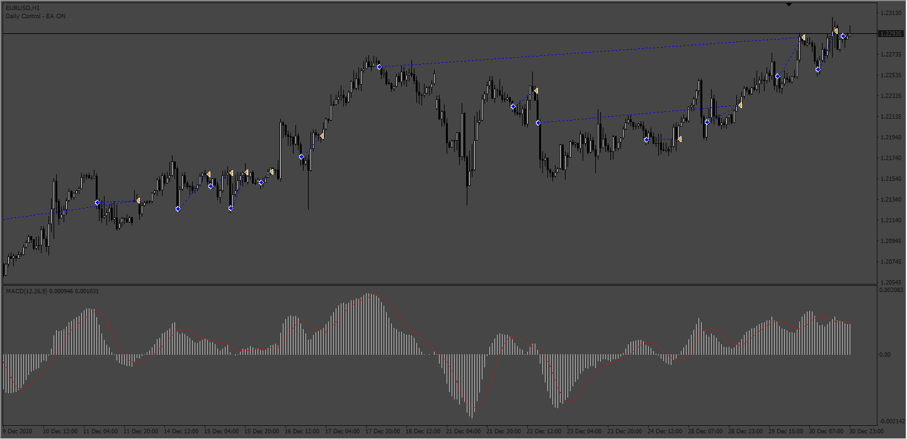
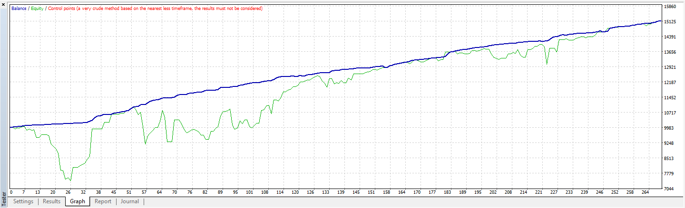
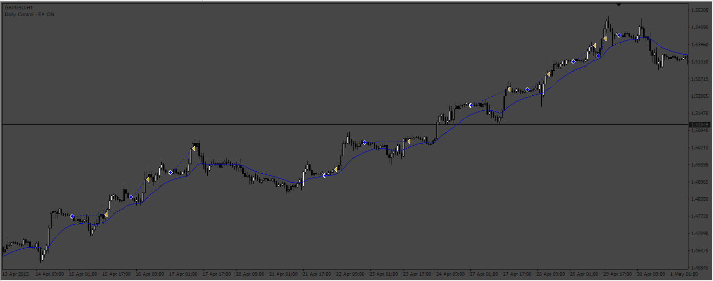
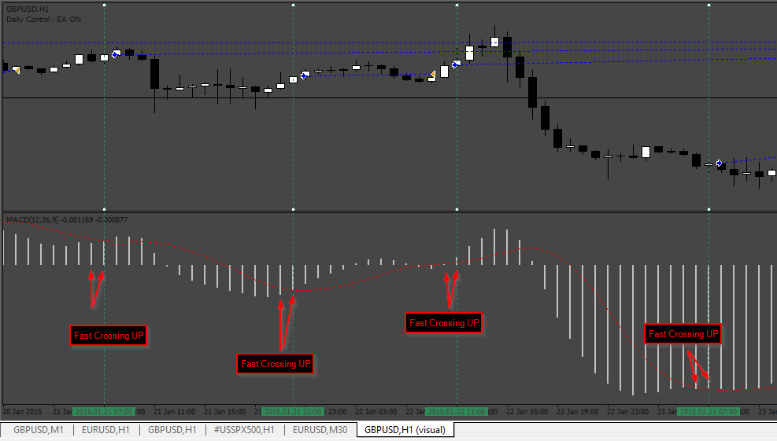
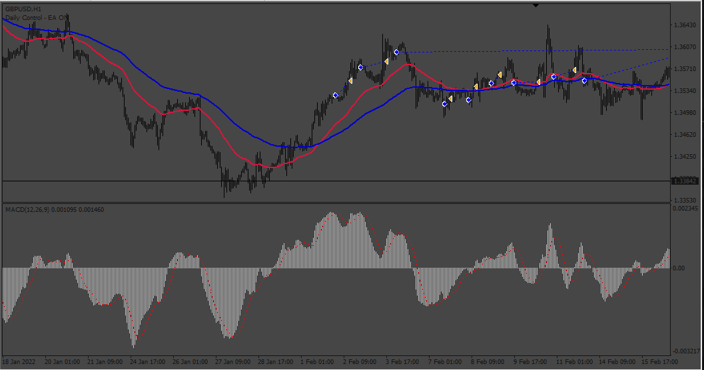

# Only_Long_MACD EA

> Source: https://fxcodebase.com/code/viewtopic.php?f=38&t=73552  
> Forum: 38 · Topic 73552 · 20 post(s)

---

## Only_Long_MACD EA

**Apprentice** · Sat Apr 01, 2023 8:14 am

 

Based on the request.
[https://fxcodebase.com/code/viewtopic.php?f=38&t=73519](https://fxcodebase.com/code/viewtopic.php?f=38&t=73519)

 [Only_Long_MACD EA.mq4](files/150216/Only_Long_MACD%20EA.mq4)

---

## Re: Only_Long_MACD EA

**tutumlgb** · Sat Apr 01, 2023 8:36 am

> **Apprentice wrote:**
>
>
> The attachment **269pic.png** is no longer available
>
>
>
>
> The attachment **269pic.png** is no longer available
>
>
> Based on the request.
> [https://fxcodebase.com/code/viewtopic.php?f=38&t=73519](https://fxcodebase.com/code/viewtopic.php?f=38&t=73519)
>
>
> The attachment **269pic.png** is no longer available

It seems that the conditions for opening a position are written backwards

---

## Re: Only_Long_MACD EA

**Apprentice** · Mon Apr 03, 2023 7:55 am

We have added your request to the development list.
Development reference 291.

---

## Re: Only_Long_MACD EA

**tutumlgb** · Mon Apr 03, 2023 1:59 pm

> **Apprentice wrote:**
> We have added your request to the development list.
> Development reference 291.

hello，sir
I want to pay to customize an EA of my own

---

## Re: Only_Long_MACD EA

**tutumlgb** · Mon Apr 03, 2023 3:19 pm

> **Apprentice wrote:**
> We have added your request to the development list.
> Development reference 291.

Can it be modified to the most concise mode?
just keep the macd and ema
delete all the other like stop loss or trade set or take profit and so on
thank you very much
as concise as possible

---

## Re: Only_Long_MACD EA

**Apprentice** · Wed Apr 05, 2023 8:23 am

We have added your request to the development list.
Development reference 307.

---

## Re: Only_Long_MACD EA

**Apprentice** · Fri Apr 07, 2023 2:22 pm

it’s a new version of task 291

 [Only_Long_MACD_v3.mq4](files/150330/Only_Long_MACD_v3.mq4)

it’s a new version of task 307

 [Only_Long_MACD_v2.mq4](files/150330/Only_Long_MACD_v2.mq4)

---

## Re: Only_Long_MACD EA

**tutumlgb** · Fri Apr 07, 2023 8:42 pm

> **Apprentice wrote:**
> it’s a new version of task 291
>
>
> Only_Long_MACD_v3.mq4
>
>
>
> it’s a new version of task 307
>
>
> Only_Long_MACD_v2.mq4

I mean you still don't understand, the code is more than 4000 lines in total, which is too much, I want to keep only the relevant content of MACD and MA, and all the rest of the stop-loss, take profit and other conditions are removed from the code

---

## Re: Only_Long_MACD EA

**tutumlgb** · Sat Apr 08, 2023 11:32 am

> **Apprentice wrote:**
> it’s a new version of task 291
>
>
> Only_Long_MACD_v3.mq4
>
>
>
> it’s a new version of task 307
>
>
> Only_Long_MACD_v2.mq4

I mean, if you can do it in less than 300 lines, just use 300 lines and delete the remaining 3700 lines of code

---

## Re: Only_Long_MACD EA

**cirque73** · Sat Apr 08, 2023 11:38 am

Can we get a moving avg filter on this? Thanks!

---

## Re: Only_Long_MACD EA

**Apprentice** · Wed Apr 12, 2023 3:37 am

We have added your request to the development list.
Development reference 319.

---

## Re: Only_Long_MACD EA

**tutumlgb** · Wed Apr 12, 2023 8:49 am

> **Apprentice wrote:**
> We have added your request to the development list.
> Development reference 319.

The shorter the better, as long as it can express the usage of MACD and retain the parameters of the EMA moving average, thank you very much

---

## Re: Only_Long_MACD EA

**Apprentice** · Sat Apr 15, 2023 4:15 am

 [Only_Long_MACD_EMA_filter.mq4](files/150431/Only_Long_MACD_EMA_filter.mq4)

---

## Re: Only_Long_MACD EA

**tutumlgb** · Sat Apr 15, 2023 8:36 am

> **Apprentice wrote:**
>
>
> 319pic.png
>
>
>
>
> Only_Long_MACD_EMA_filter.mq4

It seems that the length of the code has not decreased, it is still more than 4000 lines,

---

## Re: Only_Long_MACD EA

**tutumlgb** · Sat Apr 15, 2023 8:53 am

> **Apprentice wrote:**
>
>
> 319pic.png
>
>
>
>
> Only_Long_MACD_EMA_filter.mq4

It seems that the length of the code has not decreased, it is still more than 4000 lines, and the problem of opening positions has returned, opening positions is always long in MACD down cross...

---

## Re: Only_Long_MACD EA

**Apprentice** · Wed Apr 19, 2023 5:38 am

We have added your request to the development list.
Development reference 339.

---

## Re: Only_Long_MACD EA

**Apprentice** · Sun Apr 23, 2023 2:31 pm

---

## Re: Only_Long_MACD EA

**Fintil** · Wed Jan 03, 2024 8:22 am

Hello Mr. Apprentice, thank you for your great job. I would like to ask you, if it is possible to ad this condition for version Only_Long_MACD_V3 : integrate 2 Moving averages first MA100 and second MA40, if MA40 cross MA100 upwards =) start trading. If MA40 cross downwards =) stop trading. Thank you very much.

---

## Re: Only_Long_MACD EA

**Apprentice** · Wed Jan 10, 2024 7:39 am

We have added your request to the development list.
Development reference 56

---

## Re: Only_Long_MACD EA

**Apprentice** · Sat Jan 13, 2024 2:35 pm

 [Only_Long_MACD_v4_MA.mq4](files/154020/Only_Long_MACD_v4_MA.mq4)
