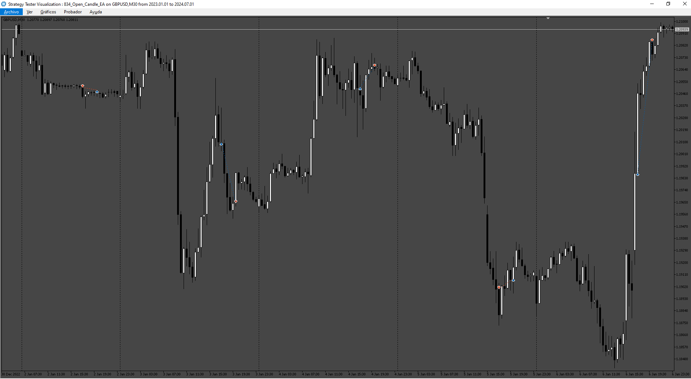
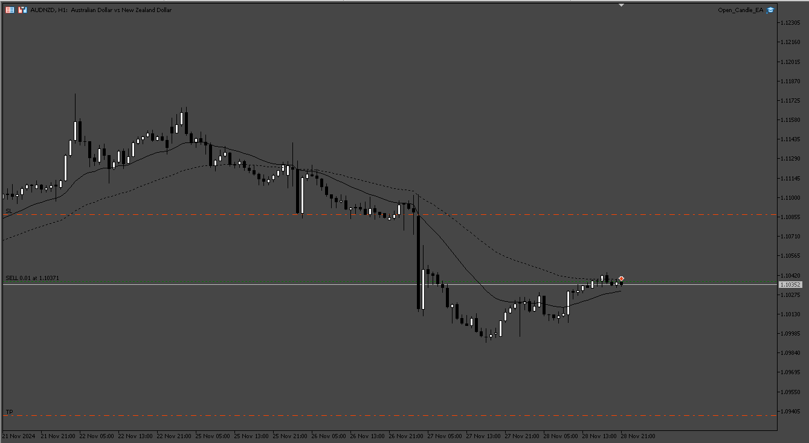
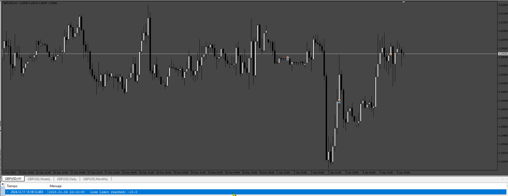
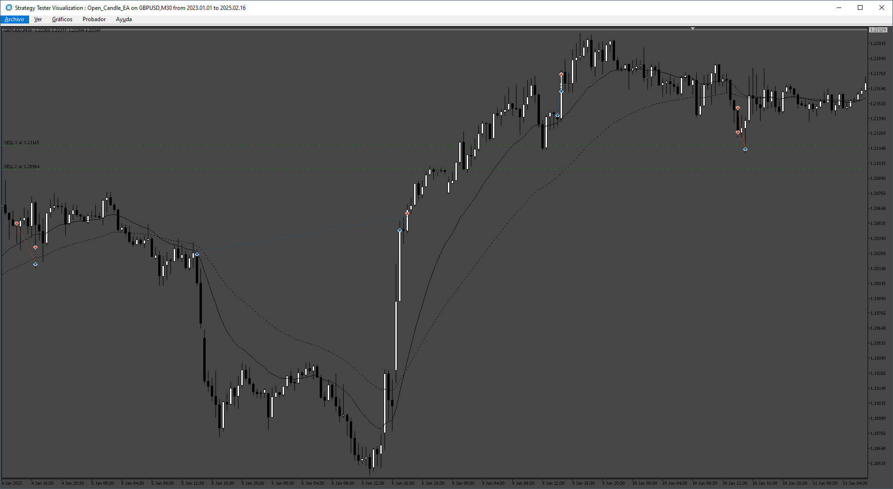

# Open_Candle_EA

> Source: https://fxcodebase.com/code/viewtopic.php?f=38&t=75360  
> Forum: 38 · Topic 75360 · 13 post(s)

---

## Open_Candle_EA

**Apprentice** · Sun Nov 17, 2024 5:04 am

Based on the request.
[https://fxcodebase.com/code/viewtopic.php?f=38&t=75341](https://fxcodebase.com/code/viewtopic.php?f=38&t=75341)

 [Open_Candle_EA.mq5](files/157271/Open_Candle_EA.mq5)

---

## Re: Open_Candle_EA

**TruCxpt** · Mon Nov 25, 2024 3:06 pm

> **Apprentice wrote:**
>
>
> 834.png
>
>
> Based on the request.
> [https://fxcodebase.com/code/viewtopic.php?f=38&t=75341](https://fxcodebase.com/code/viewtopic.php?f=38&t=75341)
>
>
> Open_Candle_EA.mq5

Hello apprentice!

The EA tests fine in backtests etc, it just doesn't do anything when placed on a chart for some reason. No entry, nothing. Not sure why this is, could you fix this please? Thanks.

---

## Re: Open_Candle_EA

**Apprentice** · Wed Nov 27, 2024 2:43 pm

We have added your request to the development list.
Development reference 877

---

## Re: Open_Candle_EA

**Apprentice** · Sun Dec 01, 2024 5:20 am

 [Open_Candle_EA.mq5](files/157402/Open_Candle_EA.mq5)

---

## Re: Open_Candle_EA

**TruCxpt** · Thu Dec 05, 2024 1:52 pm

> **Apprentice wrote:**
>
>
> 877.png
>
>
>
>
> Open_Candle_EA.mq5

Please make sure EA respects the daily position limits.

Thankyou.

---

## Re: Open_Candle_EA

**Apprentice** · Mon Dec 09, 2024 5:31 am

We have added your request to the development list.
Development reference 910

---

## Re: Open_Candle_EA

**Apprentice** · Fri Dec 13, 2024 3:53 pm

 [Open_Candle_EA.mq5](files/157538/Open_Candle_EA.mq5)

---

## Re: Open_Candle_EA

**TruCxpt** · Sat Dec 28, 2024 8:40 pm

> **Apprentice wrote:**
>
>
> 910.png
>
>
>
>
> Open_Candle_EA.mq5

I think you may have misunderstood. By position limits, I meant the **number of open positions the EA opens daily.**

All I wanted first was an EA that opens a position based on a specific candle time, long or short based on open price. Seriously, how hard is this to make functional, I made the request as simple as possible to avoid issues and it still wasn't enough. The EA did not enter anything on a live chart. I ask for this to be fixed, only then for the EA to keep opening orders if SL is reached during the same candle. Then, you put a position limit loss- and even that doesn't work at all. I don't understand what is so difficult to implement a simple fix to the original problem.

The EA doesn't open orders on a **live chart**. Then you just gave it additional issues. I get this is a free service, but really now? Why does nearly every other post I see have flawless EAs and indicators, working as intended, using the most arbitrary rules, yet one as simple as mine can't work.

---

## Re: Open_Candle_EA

**Apprentice** · Mon Dec 30, 2024 7:43 pm

We have added your request to the development list.
Development reference 930

---

## Re: Open_Candle_EA

**Apprentice** · Thu Jan 23, 2025 3:58 pm

[Open_Candle_EA_v1.00.mq5](files/157972/Open_Candle_EA_v1.00.mq5)

Try this version.

---

## Re: Open_Candle_EA

**[email protected]** · Wed Jun 04, 2025 2:46 pm

> **Apprentice wrote:**
>
>
> Open_Candle_EA_v1.00.mq5
>
>
> Try this version.

Hi. Please add Grid option to this Ea (Last version)

Grid with these Options:

Grid Setup:
Grid: (On/Off)
Grid mode (Stop) , Stop : only open positions when first position gain profit . for buy signal only buy grid and for sell signal only sell grid.
Grid on( true/false)
Lot mode (Multiplier/ Addition)
Grid mode (Stop) , Stop : open positions when first position (signal) gain profit
First grid distance : Pip ( distance between signal position and first Grid position)
Grid Max Count by user : (Number)
Grid Max Lot by user : (Lot)
Grid Multiplier by user : (Factor)
Grid Addition Lot by user : (Lot)
Grid Distance by user : (Pip)
Close Grid: (True/False)
Close grid TP: (Pips)
Close grid SL: (Pips)
Close grid in opposite signal: (True/False)

Mandatory close all Grid Positions at end of the Session: (True/False)

Thanks.

---

## Re: Open_Candle_EA

**Apprentice** · Thu Jun 05, 2025 5:14 am

We have added your request to the development list.
Development reference 371

---

## Re: Open_Candle_EA

**Apprentice** · Thu Jun 12, 2025 4:07 am

 [Open_Candle_EA.mq5](files/159584/Open_Candle_EA.mq5)
