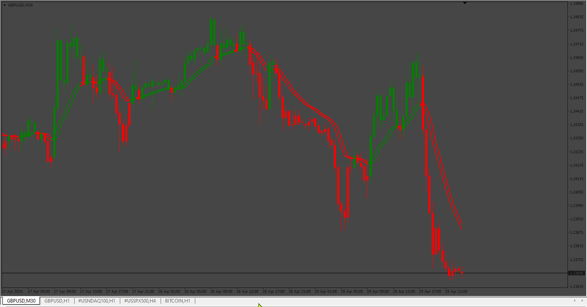

# Open Close Cross Strategy

> Source: https://fxcodebase.com/code/viewtopic.php?f=38&t=66533  
> Forum: 38 · Topic 66533 · 20 post(s)

---

## Open Close Cross Strategy

**Apprentice** · Fri Aug 17, 2018 5:26 am

[Open Close Cross Strategy R5.1 revised by JustUncleL.mq4](files/120613/Open%20Close%20Cross%20Strategy%20R5.1%20revised%20by%20JustUncleL.mq4)

 [Open Close Cross Strategy R5.1 revised by JustUncleL EA.mq4](files/120613/Open%20Close%20Cross%20Strategy%20R5.1%20revised%20by%20JustUncleL%20EA.mq4)

Based on request.
[viewtopic.php?f=27&p=120595](https://fxcodebase.com/code/viewtopic.php?f=27&p=120595)

Please install averages.mq4

 [averages.mq4](files/120613/averages.mq4)

---

## Re: Open Close Cross Strategy

**Jagg1010** · Thu Aug 30, 2018 4:54 am

I added the indicator to a chart and set it like on the screenshot.

This indicator is always/ever only showing green candles here, this can't be correct, can it?

(I added manually the blue EMA's period 8 -open and close- too have it visually shown better)

---

## Re: Open Close Cross Strategy

**Apprentice** · Thu Aug 30, 2018 1:41 pm

Were averages.mq4 you installed?

---

## Re: Open Close Cross Strategy

**Jagg1010** · Thu Aug 30, 2018 2:42 pm

Yes, averages.mq4 from post 1 here.

Here are two more screenshots...

---

## Re: Open Close Cross Strategy

**Apprentice** · Sun Sep 02, 2018 2:51 am

Found a typo. Fixed.

---

## Re: Open Close Cross Strategy

**Jagg1010** · Mon Sep 03, 2018 5:14 am

> **Apprentice wrote:**
> Found a typo. Fixed.

looking good now, thanks

---

## Re: Open Close Cross Strategy

**jucaorma** · Tue Sep 04, 2018 4:36 pm

when active the EA is not installed and does not appear or work.
could you give me some instructions please

Thank you

---

## Re: Open Close Cross Strategy

**cedricnoel42** · Thu Sep 06, 2018 9:25 am

There is an error compliling the EA file at line 193.

And even when I fixed the error, and runned the EA, no trades happened.
I tried multiple timeframes and setting, but nothing.

---

## Re: Open Close Cross Strategy

**Apprentice** · Mon Sep 10, 2018 9:15 am

line 193 error fixed.

---

## Re: Open Close Cross Strategy

**[email protected]** · Mon Sep 27, 2021 4:22 am

can we have this indicator in lua also please?

---

## Re: Open Close Cross Strategy

**[email protected]** · Mon Sep 27, 2021 4:54 am

hi i was testing it just hang the mt4 terminal nothing happened
i put both indicators in indicators folder
and expert in experts folder
any instructions please?

---

## Re: Open Close Cross Strategy

**Apprentice** · Mon Sep 27, 2021 9:00 am

Your request is added to the development list.
Development reference 872.

---

## Re: Open Close Cross Strategy

**Apprentice** · Thu Oct 07, 2021 11:38 am

[Open_Close_Cross_Strategy_R5.1_revised_by_JustUncleL_EA.mq4](files/143885/Open_Close_Cross_Strategy_R5.1_revised_by_JustUncleL_EA.mq4)

 [Open_Close_Cross_Strategy_R5.1_revised_by_JustUncleL.mq4](files/143885/Open_Close_Cross_Strategy_R5.1_revised_by_JustUncleL.mq4)

Try it now.

---

## Re: Open Close Cross Strategy

**mtrade** · Fri Apr 15, 2022 8:14 am

I don't know if I'm missin anything here? But this is a bit different from the tradingview indicator. The tradingview indicator has red/green colors and also more input parameter options..

Thanks

---

## Re: Open Close Cross Strategy

**sino2361992** · Sat Dec 10, 2022 1:29 am

> **Apprentice wrote:**
>
>
> Open_Close_Cross_Strategy_R5.1_revised_by_JustUncleL_EA.mq4
>
>
>
>
> Open_Close_Cross_Strategy_R5.1_revised_by_JustUncleL.mq4
>
>
> Try it now.

Can you please please please make this EA strategy same as this one by the same author from TradingView he says this one is NRP (No Repaint Version) and i have back test it and it's giving amazing
results i will even pay for it. if you can make it give same entries (Buy and Sell) signals and on all pairs not just EU. i think the only difference is that he added option to recalculate after order is filled and he added option (use alternative resolution) with (Multiplier for alternate resolution)
please brother i beg you to make this EA in mt4 as i have back test it from 2008 and it's giving me amazing results. if you want i can share with you excellsheet of back testing to improve it even more.

this is my email if you want to contact me [[email protected]](https://fxcodebase.com/cdn-cgi/l/email-protection#45362c2b242b6b2b2c212d2428052228242c296b262a28)

Thank you so much dear

[https://www.tradingview.com/script/9wda ... ustUncleL/](https://www.tradingview.com/script/9wda3yUw-Open-Close-Cross-Strategy-NoRepaint-Version-by-JustUncleL/)

---

## Re: Open Close Cross Strategy

**sino2361992** · Sat Dec 10, 2022 1:31 am

> **Apprentice wrote:**
>
>
> The attachment **Open_Close_Cross_Strategy_R5.1_revised_by_JustUncleL_EA.mq4** is no longer available
>
>
>
>
> The attachment **Open_Close_Cross_Strategy_R5.1_revised_by_JustUncleL_EA.mq4** is no longer available
>
>
> Try it now.

Can you please please please make this EA strategy same as this one by the same author from TradingView he says this one is NRP (No Repaint Version) and i have back test it and it's giving amazing results! I will even pay for it. if you can make it give same entries (Buy and Sell) signals and on all pairs not just EU. i think the only difference is that he added option to recalculate after order is filled and he added option (use alternative resolution) with (Multiplier for alternate resolution)
please brother i beg you to make this EA in mt4 as i have back test it from 2008 and it's giving me amazing results. if you want i can share with you excellsheet of back testing to improve it even more.

this is my email if you want to contact me [[email protected]](https://fxcodebase.com/cdn-cgi/l/email-protection#addec4c3ccc383c3c4c9c5ccc0edcac0ccc4c183cec2c0)

Thank you so much dear

[https://www.tradingview.com/script/9wda ... ustUncleL/](https://www.tradingview.com/script/9wda3yUw-Open-Close-Cross-Strategy-NoRepaint-Version-by-JustUncleL/)

---

## Re: Open Close Cross Strategy

**gsam1969** · Wed Nov 29, 2023 7:22 am

this is not work only show green, why ?

```lua
// Id: 22037
// More information about this indicator can be found at:
// http://fxcodebase.com/

//+------------------------------------------------------------------+
//|                               Copyright © 2018, Gehtsoft USA LLC |
//|                                            http://fxcodebase.com |
//+------------------------------------------------------------------+
//|                                      Developed by : Mario Jemic  |
//|                                          [[email protected]](https://fxcodebase.com/cdn-cgi/l/email-protection)   |
//+------------------------------------------------------------------+
//|                                 Support our efforts by donating  |
//|                                  Paypal : https://goo.gl/9Rj74e  |
//+------------------------------------------------------------------+
//|                                Patreon :  https://goo.gl/GdXWeN  |
//|                    BitCoin : 15VCJTLaz12Amr7adHSBtL9v8XomURo9RF  |
//|               BitCoin Cash : 1BEtS465S3Su438Kc58h2sqvVvHK9Mijtg  |
//|           Ethereum : 0x8C110cD61538fb6d7A2B47858F0c0AaBd663068D  |
//|                   LiteCoin : LLU8PSY2vsq7B9kRELLZQcKf5nJQrdeqwD  |
//+------------------------------------------------------------------+

#property copyright "Copyright © 2018, Gehtsoft USA LLC"
#property link      "http://fxcodebase.com"
#property version "1.0.1"

#property description "Open Close Cross Strategy R5.1 revised by JustUncleL"
#property strict

#property indicator_buffers 14
#property indicator_chart_window

#property indicator_color3  clrGreen
#property indicator_width3  2

#property indicator_color4  clrRed
#property indicator_width4  2

#property indicator_color5  clrGreen
#property indicator_width5  2

#property indicator_color6  clrRed
#property indicator_width6  2

enum AveragesMethod
{
   SMA = MODE_SMA, // SMA
   EMA = MODE_EMA, // EMA
   SMMA = MODE_SMMA, // SMMA
   LWMA = MODE_LWMA, // LWMA
   WMA,
   SineWMA,
   TriMA,
   LSMA,
   HMA,
   ZeroLagEMA,
   DEMA,
   T3MA,
   ITrend,
   Median,
   GeoMean,
   REMA,
   ILRS,
   IE2,
   TriMAgen,
   JSmooth
};

enum TradingDirection
{
    Buy,
    Sell,
    Both
};

enum StopLimitType
{
    StopLimitPercent, // %
    StopLimitPips, // Pips
    StopLimitDollar // $
};

enum PositionSizeType
{
    PositionSizeAmount, // $
    PositionSizeContract, // In contracts
    PositionSizeEquity // % of equity
};

enum PositionDirection
{
    DirectLogic, // Direct
    ReversalLogic // Reversal
};

extern bool useRes = true; // Use Alternate Resolution?
extern int intRes = 3; // Multiplier for Alernate Resolution
extern AveragesMethod basisType = SMMA; // MA Type
extern int basisLen = 8; // MA Period
//offsetSigma = input(defval = 6, title = "Offset for LSMA / Sigma for ALMA", minval = 0)
//offsetALMA  = input(defval = 0.85, title = "Offset for ALMA", minval = 0, step = 0.01)
extern bool scolor = false; // Show coloured Bars to indicate Trend?
extern color UpCandleColor = clrGreen; // Up bars color
extern color DownCandleColor = clrRed; // Down bars color

extern bool AllowTrading = true; // Allow trading?
extern TradingDirection TradeType = Both; // What trades should be taken
extern double Lots            = 0.1; // Position size
extern PositionSizeType LotsType = PositionSizeContract; // Position size type
extern int Slippage           = 3;
extern bool close_on_opposite = true; // Close on opposite
extern bool SetStop           = true; // Set stop loss?
extern double Stop            = 10; // Stop loss value
extern StopLimitType StopType = StopLimitPips; // Stop loss type
extern bool SetLimit          = true; // Set take profit?
extern double Limit           = 10; // Take profit value
extern StopLimitType LimitType = StopLimitPips; // Take profit type
extern bool MoveToBreakeven = false; // Move to breakeven
extern double BreakevenTrigger = 10; // Trigger for the breakeven
extern StopLimitType BreakevenTriggerType = StopLimitPips; // Trigger type for the breakeven
extern int MagicNumber        = 42; // Magic number
extern PositionDirection LogicType = DirectLogic; // Logic type

// Candles stream v.1.0.0
class CandleStreams
{
public:
   double OpenStream[];
   double CloseStream[];
   double HighStream[];
   double LowStream[];

   void Clear(const int index)
   {
      OpenStream[index] = EMPTY_VALUE;
      CloseStream[index] = EMPTY_VALUE;
      HighStream[index] = EMPTY_VALUE;
      LowStream[index] = EMPTY_VALUE;
   }

   int RegisterStreams(const int id, const color clr)
   {
      SetIndexStyle(id + 0, DRAW_HISTOGRAM, STYLE_SOLID, 3, clr);
      SetIndexBuffer(id + 0, OpenStream);
      SetIndexStyle(id + 1, DRAW_HISTOGRAM, STYLE_SOLID, 3, clr);
      SetIndexBuffer(id + 1, CloseStream);
      SetIndexStyle(id + 2, DRAW_HISTOGRAM, STYLE_SOLID, 1, clr);
      SetIndexBuffer(id + 2, HighStream);
      SetIndexStyle(id + 3, DRAW_HISTOGRAM, STYLE_SOLID, 3, clr);
      SetIndexBuffer(id + 3, LowStream);
      return id + 4;
   }

   void Set(const int index, const double open, const double high, const double low, const double close)
   {
      OpenStream[index] = open;
      HighStream[index] = high;
      LowStream[index] = low;
      CloseStream[index] = close;
   }
};

CandleStreams upCandles;
CandleStreams downCandles;

double closeSeries[], openSeries[];
double closeSeriesUp[], closeSeriesDown[];
double openSeriesUp[], openSeriesDown[];
ENUM_TIMEFRAMES btf = PERIOD_CURRENT;

ENUM_TIMEFRAMES RoundPeriod(const int period)
{
   if (period < PERIOD_M5)
      return PERIOD_M1;
   if (period < PERIOD_M15)
      return PERIOD_M5;
   if (period < PERIOD_M30)
      return PERIOD_M15;
   if (period < PERIOD_H1)
      return PERIOD_M30;
   if (period < PERIOD_H4)
      return PERIOD_H1;
   if (period < PERIOD_D1)
      return PERIOD_H4;
   if (period < PERIOD_W1)
      return PERIOD_D1;
   if (period < PERIOD_MN1)
      return PERIOD_W1;
   return PERIOD_MN1;
}

int OnInit()
{
   if (useRes)
   {
      btf = RoundPeriod(_Period * intRes);
   }
   tradingLogic = new TradeController(_Symbol);
   
   SetIndexBuffer(0, openSeries);
   SetIndexStyle(0, DRAW_NONE);
   SetIndexBuffer(1, closeSeries);
   SetIndexStyle(1, DRAW_NONE);

   SetIndexBuffer(2, openSeriesUp);
   SetIndexBuffer(3, openSeriesDown);
   SetIndexBuffer(4, closeSeriesUp);
   SetIndexBuffer(5, closeSeriesDown);
   if (scolor)
   {
      int id = upCandles.RegisterStreams(6, UpCandleColor);
      downCandles.RegisterStreams(id, DownCandleColor);
   }
   return INIT_SUCCEEDED;
}

void OnDeinit(const int reason)
{
   delete tradingLogic;
}

int OnCalculate(const int rates_total,
                const int prev_calculated,
                const datetime &time[],
                const double &open[],
                const double &high[],
                const double &low[],
                const double &close[],
                const long &tick_volume[],
                const long &volume[],
                const int &spread[])
{
   for (int i = Bars - prev_calculated - 1; i >= 0; --i)
   {
      if (btf != PERIOD_CURRENT && btf != _Period)
      {
         int btfIndex = iBarShift(Symbol(), btf, Time[i]);
         if (btfIndex != -1)
         {
            openSeries[i] = iCustom(_Symbol, btf, "Open Close Cross Strategy R5.1 revised by JustUncleL", false, 0, basisType, basisLen, false, clrRed, clrRed, false, 0, btfIndex);
            closeSeries[i] = iCustom(_Symbol, btf, "Open Close Cross Strategy R5.1 revised by JustUncleL", false, 0, basisType, basisLen, false, clrRed, clrRed, false, 1, btfIndex);
         }
      }
      else
      {
         openSeries[i] = GetAveragesValue(basisType, basisLen, PRICE_OPEN, i);
         closeSeries[i] = GetAveragesValue(basisType, basisLen, PRICE_CLOSE, i);
      }
     
      if (closeSeries[i] > openSeries[i])
      {
         if (i < Bars - 1 && closeSeriesUp[i + 1] == EMPTY_VALUE)
         {
            closeSeriesUp[i + 1] = closeSeries[i + 1];
            openSeriesUp[i + 1] = openSeries[i + 1];
         }
         closeSeriesUp[i] = closeSeries[i];
         closeSeriesDown[i] = EMPTY_VALUE;
         openSeriesUp[i] = openSeries[i];
         openSeriesDown[i] = EMPTY_VALUE;
         if (scolor)
         {
            upCandles.Set(i, Open[i], High[i], Low[i], Close[i]);
            downCandles.Clear(i);
         }
      }
      else
      {
         if (i < Bars - 1 && closeSeriesDown[i + 1] == EMPTY_VALUE)
         {
            closeSeriesDown[i + 1] = closeSeries[i + 1];
            openSeriesDown[i + 1] = openSeries[i + 1];
         }
         closeSeriesUp[i] = EMPTY_VALUE;
         closeSeriesDown[i] = closeSeries[i];
         openSeriesUp[i] = EMPTY_VALUE;
         openSeriesDown[i] = openSeries[i];
         if (scolor)
         {
            downCandles.Set(i, Open[i], High[i], Low[i], Close[i]);
            upCandles.Clear(i);
         }
      }
   }
   if (AllowTrading)
      tradingLogic.DoTrading();
   return rates_total;
}
 
// Breakeven controller v. 1.0.0
class BreakevenController
{
    int _order;
    bool _finished;
    double _trigger;
    double _target;
public:
    BreakevenController()
    {
        _finished = false;
    }
   
    bool SetOrder(const int order, const double trigger, const double target)
    {
        if (!_finished)
        {
            return false;
        }
        _finished = false;
        _trigger = trigger;
        _target = target;
        _order = order;
        return true;
    }

    void DoLogic()
    {
        if (_finished || !OrderSelect(_order, SELECT_BY_TICKET, MODE_TRADES))
        {
            _finished = true;
            return;
        }

        int type = OrderType();
        if (type == OP_BUY)
        {
            if (Ask >= _trigger)
            {
                int res = OrderModify(OrderTicket(), OrderOpenPrice(), _target, OrderTakeProfit(), 0, CLR_NONE);
                _finished = true;
            }
        }
        else if (type == OP_SELL)
        {
            if (Bid < _trigger)
            {
                int res = OrderModify(OrderTicket(), OrderOpenPrice(), _target, OrderTakeProfit(), 0, CLR_NONE);
                _finished = true;
            }
        }
    }
};

// Math helper v.1.0.0
bool crossOver(const double &left[], const double &right[], const int period)
{
   return left[period] > right[period] && left[period + 1] < right[period + 1];
}

bool crossUnder(const double &left[], const double &right[], const int period)
{
   return left[period] < right[period] && left[period + 1] > right[period + 1];
}

// Trade controller v.1.0.1
class TradeController
{
   bool IsBuyCondition()
   {
      if ((TradeType == Sell && LogicType == DirectLogic)
         || (TradeType == Buy && LogicType == ReversalLogic))
      {
         return false;
      }
      return crossOver(closeSeries, openSeries, 0);
   }

   bool IsSellCondition()
   {
      if ((TradeType == Buy && LogicType == DirectLogic)
         || (TradeType == Sell && LogicType == ReversalLogic))
      {
         return false;
      }
      return crossUnder(closeSeries, openSeries, 0);
   }

   string _symbol;
   double _point;
   datetime _lastbartime;
   int _digit;
   double _mult;
   BreakevenController *_breakeven[];
public:
   TradeController(const string symbol)
   {
      _symbol = symbol;
      _point = MarketInfo(_symbol, MODE_POINT);
      _digit = (int)MarketInfo(_symbol, MODE_DIGITS);
      _mult = _digit == 3 || _digit == 5 ? 10 : 1;
   }

   ~TradeController()
   {
      int i_count = ArraySize(_breakeven);
      for (int i = 0; i < i_count; ++i)
      {
         delete _breakeven[i];
      }
   }

   void DoTrading()
   {
      int i_count = ArraySize(_breakeven);
      for (int i = 0; i < i_count; ++i)
      {
         _breakeven[i].DoLogic();
      }
      datetime current_time = iTime(NULL, _Period, 0);
      if (current_time == _lastbartime)
      {
         return;
      }

      if (IsBuyCondition())
      {
         switch (LogicType)
         {
            case DirectLogic:
               DoBuy();
               break;
            case ReversalLogic:
               DoSell();
               break;
         }
      }
      if (IsSellCondition())
      {
         switch (LogicType)
         {
            case DirectLogic:
               DoSell();
               break;
            case ReversalLogic:
               DoBuy();
               break;
         }
      }
   }
private:
   double CalculateSLShift(const double amount, const double money)
   {
      double unitCost = MarketInfo(_symbol, MODE_TICKVALUE);
      double tickSize = MarketInfo(_symbol, MODE_TICKSIZE);
      return (money / (unitCost / tickSize)) / amount;
   }

   double CalculateStop(const bool isBuy, const double amount, double basePrice)
   {
      if (!SetStop)
         return 0;

      int direction = isBuy ? 1 : -1;
      switch (StopType)
      {
         case StopLimitPercent:
            return basePrice - basePrice * Stop / 100.0 * direction;
         case StopLimitPips:
            return basePrice - Stop * _mult * _point * direction;
         case StopLimitDollar:
            return basePrice - CalculateSLShift(amount, Stop) * direction;
      }
      return 0.0;
   }

   double CalculateLimit(const bool isBuy, const double limit, const StopLimitType limitType, const double amount, double basePrice)
   {
      int direction = isBuy ? 1 : -1;
      switch (limitType)
      {
         case StopLimitPercent:
            return basePrice + basePrice * limit / 100.0 * direction;
         case StopLimitPips:
            return basePrice + limit * _mult * _point * direction;
         case StopLimitDollar:
            return basePrice + CalculateSLShift(amount, limit) * direction;
      }
      return 0.0;
   }
   
   double CalculateLimit(const bool isBuy, const double amount, double basePrice)
   {
      if (!SetLimit)
         return 0;

      return CalculateLimit(isBuy, Limit, LimitType, amount, basePrice);
   }

   void DoBuy()
   {
      if (close_on_opposite)
      {
         CloseTrades(OP_SELL);
      }

      double amount = GetLots();
      MarketOrderBuilder *orderBuilder = new MarketOrderBuilder();
      int order = orderBuilder
         .SetSide(BuySide)
         .SetInstrument(_symbol)
         .SetAmount(amount)
         .SetSlippage(Slippage)
         .SetMagicNumber(MagicNumber)
         .SetStop(CalculateStop(true, amount, Ask))
         .SetLimit(CalculateLimit(true, amount, Ask))
         .Execute();
      delete orderBuilder;
      if (order != -1)
      {
         _lastbartime = iTime(NULL, _Period, 0);
         if (MoveToBreakeven)
            CreateBreakeven(order);
      }
      else
      {
         Print("Failed to open long position: " + IntegerToString(GetLastError()));
      }
   }

   void DoSell()
   {
      if (close_on_opposite)
      {
         CloseTrades(OP_BUY);
      }

      double amount = GetLots();
      MarketOrderBuilder *orderBuilder = new MarketOrderBuilder();
      int order = orderBuilder
         .SetSide(SellSide)
         .SetInstrument(_symbol)
         .SetAmount(amount)
         .SetSlippage(Slippage)
         .SetMagicNumber(MagicNumber)
         .SetStop(CalculateStop(false, amount, Bid))
         .SetLimit(CalculateLimit(false, amount, Bid))
         .Execute();
      delete orderBuilder;
      if (order != -1)
      {
         _lastbartime = iTime(NULL, _Period, 0);
         if (MoveToBreakeven)
            CreateBreakeven(order);
      }
      else
      {
         Print("Failed to open short position: " + IntegerToString(GetLastError()));
      }
   }

   double GetLotsForMoney(const double money)
   {
      double marginRequired = MarketInfo(_symbol, MODE_MARGINREQUIRED);
      double lotStep = MarketInfo(_symbol, MODE_LOTSTEP);
      return floor((money / marginRequired) / lotStep) * lotStep;
   }

   double GetLots()
   {
      switch (LotsType)
      {
         case PositionSizeAmount:
            return GetLotsForMoney(Lots);
         case PositionSizeContract:
            return Lots;
         case PositionSizeEquity:
            return GetLotsForMoney(AccountEquity() * Lots / 100.0);
      }
      return Lots;
   }

   void CloseTrades(const int side)
   {
      for (int i = OrdersTotal() - 1; i >= 0; i--)
      {
         if (OrderSelect(i, SELECT_BY_POS, MODE_TRADES))
         {
            if (OrderMagicNumber() == MagicNumber
               && OrderSymbol() == _symbol
               && OrderType() != side)
            {
               if (OrderType() == OP_BUY)
               {
                  if (!OrderClose(OrderTicket(), OrderLots(), Bid, 5))
                  {
                     Print("LastError = ", GetLastError());
                  }
               }
               if (OrderType() == OP_SELL)
               {
                  if (!OrderClose(OrderTicket(), OrderLots(), Ask, 5))
                  {
                     Print("LastError = ", GetLastError());
                  }
               }
            }
         }
      }
   }

   void CreateBreakeven(const int order)
   {
      if (!OrderSelect(order, SELECT_BY_TICKET, MODE_TRADES))
         return;

      double target = OrderType() == OP_BUY ? Ask : Bid;
      double trigger = CalculateLimit(OrderType() == OP_BUY, BreakevenTrigger, BreakevenTriggerType, OrderLots(), target);
      int i_count = ArraySize(_breakeven);
      for (int i = 0; i < i_count; ++i)
      {
         if (_breakeven[i].SetOrder(order, trigger, target))
         {
            return;
         }
      }

      ArrayResize(_breakeven, i_count + 1);
      _breakeven[i_count] = new BreakevenController();
      _breakeven[i_count].SetOrder(order, trigger, target);
   }
};

// Market order builder
// v.1.0.0

enum OrderSide
{
   BuySide,
   SellSide
};

class MarketOrderBuilder
{
   OrderSide _orderSide;
   string _instrument;
   double _amount;
   double _rate;
   int _slippage;
   double _stop;
   double _limit;
   int _magicNumber;
public:
   MarketOrderBuilder *SetSide(const OrderSide orderSide)
   {
      _orderSide = orderSide;
      return &this;
   }
   
   MarketOrderBuilder *SetInstrument(const string instrument)
   {
      _instrument = instrument;
      return &this;
   }
   
   MarketOrderBuilder *SetAmount(const double amount)
   {
      _amount = amount;
      return &this;
   }
   
   MarketOrderBuilder *SetSlippage(const int slippage)
   {
      _slippage = slippage;
      return &this;
   }
   
   MarketOrderBuilder *SetStop(const double stop)
   {
      _stop = NormalizeDouble(stop, Digits);
      return &this;
   }
   
   MarketOrderBuilder *SetLimit(const double limit)
   {
      _limit = NormalizeDouble(limit, Digits);
      return &this;
   }
   
   MarketOrderBuilder *SetMagicNumber(const int magicNumber)
   {
      _magicNumber = magicNumber;
      return &this;
   }
   
   int Execute()
   {
      int orderType = _orderSide == BuySide ? OP_BUY : OP_SELL;
      double minstoplevel = MarketInfo(_instrument, MODE_STOPLEVEL);
     
      Print("Creating " + (_orderSide == BuySide ? "buy" : "sell")
         + ". Amount: " + DoubleToStr(_amount, 2)
         + ". Stop: " + DoubleToStr(_stop, Digits)
         + ". Limit: " + DoubleToStr(_limit, Digits));
      double rate = _orderSide == BuySide ? Ask : Bid;
      int order = OrderSend(_instrument, orderType, _amount, rate, _slippage, _stop, _limit, NULL, _magicNumber);
      if (order == -1)
      {
         int error = GetLastError();
         switch (error)
         {
            case 4109:
               Print("Trading is not allowed");
               break;
            case 130:
               Print("Failed to create order: stoploss/takeprofit is too close");
               break;
            default:
               Print("Failed to create order: " + IntegerToString(error));
               break;
         }
      }
      return order;
   }
};

// Smoothing v.1.0.0

double GetAveragesValue(AveragesMethod method, int length, int price, int index)
{
   return iCustom(NULL, 0, "averages", length, 0, (int)method, price, index);
}

TradeController *tradingLogic;
```

---

## Re: Open Close Cross Strategy

**Apprentice** · Tue Dec 05, 2023 7:28 am

We have added your request to the development list.
Development reference 1082

---

## Re: Open Close Cross Strategy

**Apprentice** · Mon Apr 22, 2024 9:59 am



 [Open_Close_Cross_Strategy_v2.mq4](files/155077/Open_Close_Cross_Strategy_v2.mq4)

---

## Re: Open Close Cross Strategy

**Apprentice** · Thu Oct 17, 2024 6:48 pm

Try this version.
[https://fxcodebase.com/code/viewtopic.p ... 26#p157026](https://fxcodebase.com/code/viewtopic.php?f=38&t=75290&p=157026#p157026)
