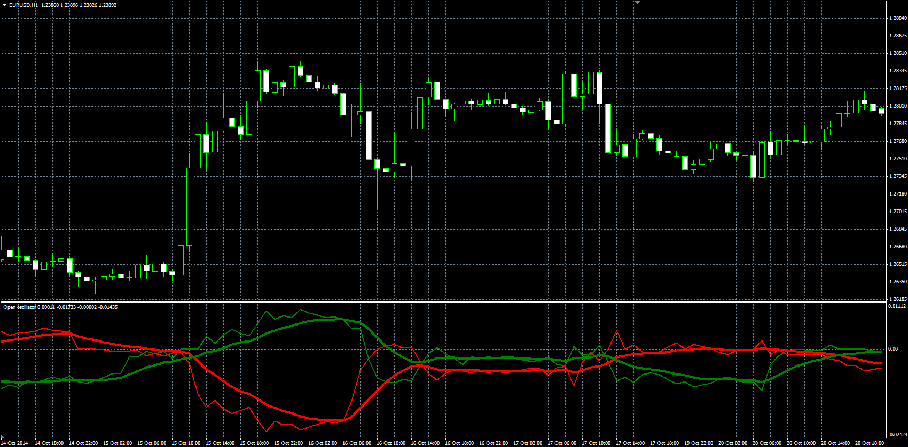

# Open oscillator

> Source: https://fxcodebase.com/code/viewtopic.php?f=38&t=61522  
> Forum: 38 · Topic 61522 · 1 post(s)

---

## Open oscillator

**Alexander.Gettinger** · Fri Nov 21, 2014 5:20 pm

Formulas:
Low[i]=Open[MinPos]-Open[i],
High[i]=Open[i]-Open[MaxPos], where
MinPos is a position of minimum Low price in range from (i-Period+1) to (i),
MaxPos is a position of maximum High price in range from (i-Period+1) to (i).

Also oscillator have a 2 signal line (EMA with [SignalPeriod]).

 

Download:

 [Open_Oscillator.mq4](files/97297/Open_Oscillator.mq4)
