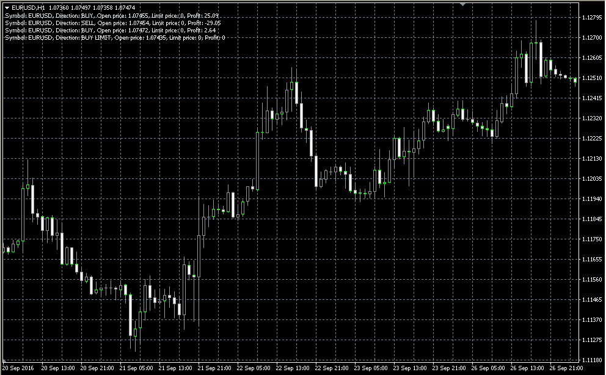

# Open positions

> Source: https://fxcodebase.com/code/viewtopic.php?f=38&t=64340  
> Forum: 38 · Topic 64340 · 5 post(s)

---

## Open positions

**Alexander.Gettinger** · Wed Jan 25, 2017 1:28 pm

The indicator shows open and pending orders on the main chart.

 

Download:

 [Open_Positions.mq4](files/110706/Open_Positions.mq4)

---

## Re: Open positions

**danjuma** · Tue Mar 06, 2018 8:24 pm

Hello. Is it possible to amend the indicator so that the user can change the font size and colour? The default font size is too small. Thank you.

---

## Re: Open positions

**Apprentice** · Fri Mar 09, 2018 6:31 am

Your request is added to the development list under Id Number 4065

---

## Re: Open positions

**Apprentice** · Sat Mar 10, 2018 7:14 pm

Try it now.

---

## Re: Open positions

**danjuma** · Sun Aug 19, 2018 7:21 am

> **Apprentice wrote:**
> Try it now.

Hello. Sorry for the late reply. I stopped checking this post a while ago thinking I was not going to get a response to my request. So, many thanks for responding to/acting on my request, much appreciated. I have tried the indi and it works fine. Only issue is that it deletes objects such as trend lines and texts from the chart when one switches time frames. Say you draw some trend lines on a 4H chart, and you now switch to a 1H chart, the trend lines disappear forever (don't even show when you switch back to the original 4H time frame.
