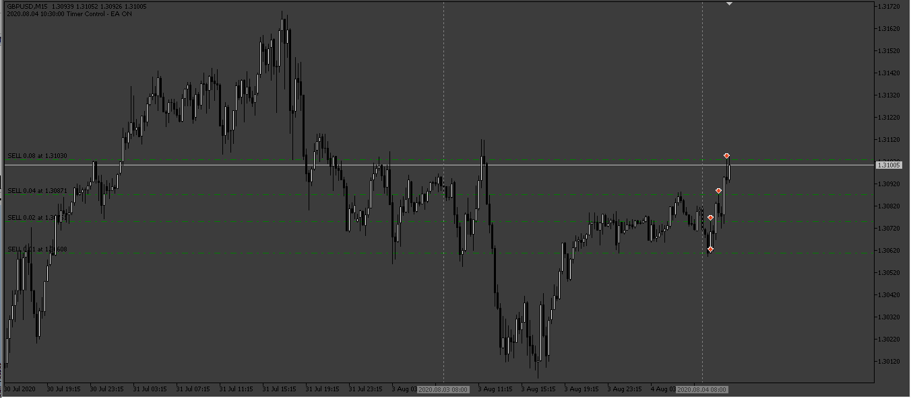
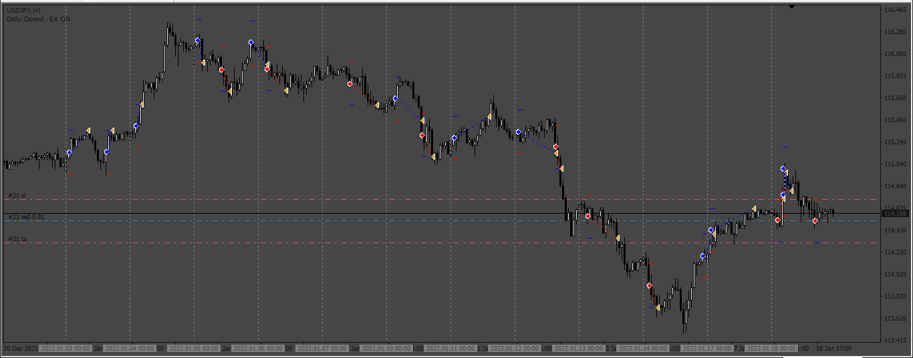
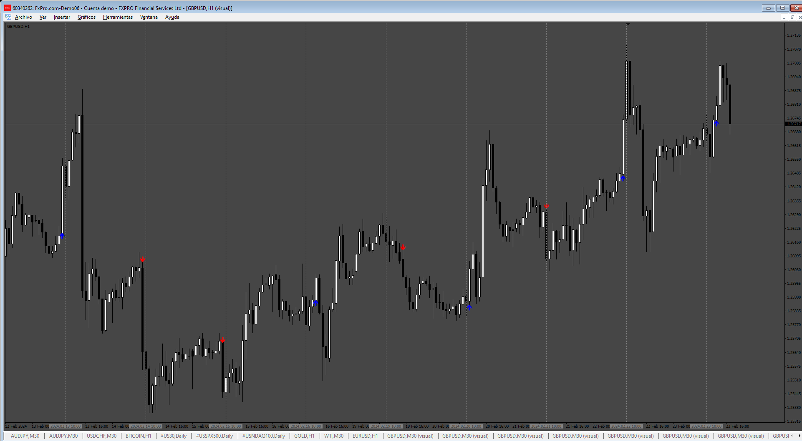
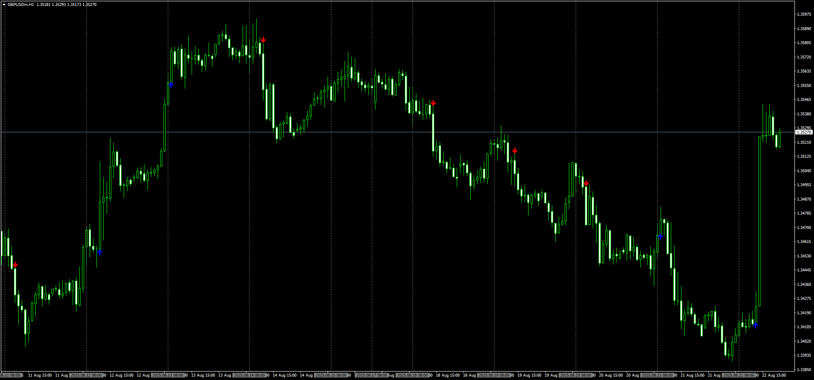

# ORB_EA_BOX

> Source: https://fxcodebase.com/code/viewtopic.php?f=38&t=74393  
> Forum: 38 · Topic 74393 · 10 post(s)

---

## ORB_EA_BOX

**Apprentice** · Thu Nov 30, 2023 2:36 pm

Based on the request.
[https://fxcodebase.com/code/viewtopic.p ... 28#p153328](https://fxcodebase.com/code/viewtopic.php?f=27&p=153328#p153328)

 [ORB_EA_BOX.mq5](files/153506/ORB_EA_BOX.mq5)

---

## Re: ORB_EA_BOX

**forextraderaz** · Wed Dec 06, 2023 11:36 pm

> **Apprentice wrote:**
>
>
> 1032.png
>
>
> Based on the request.
> [https://fxcodebase.com/code/viewtopic.p ... 28#p153328](https://fxcodebase.com/code/viewtopic.php?f=27&p=153328#p153328)
>
>
> ORB_EA_BOX.mq5

Hi,

When I compile the EA I am getting 29 warnings with the newest build 4086 can you fix these? Also can you add MT4 version?. Thanks

---

## Re: ORB_EA_BOX

**Apprentice** · Sun Dec 10, 2023 11:26 am

We have added your request to the development list.
Development reference 1098

---

## Re: ORB_EA_BOX

**Apprentice** · Wed Dec 20, 2023 3:32 am

 [ORB_EA_BOX.mq4](files/153745/ORB_EA_BOX.mq4)

---

## Re: ORB_EA_BOX

**marcelo2k9** · Fri Jul 04, 2025 6:09 pm

Please Sir, can you help us make an mt4 indicator based on this strategy and an entry point.. thank you so much

---

## Re: ORB_EA_BOX

**Apprentice** · Sun Jul 06, 2025 2:40 am

We have added your request to the development list.
Development reference 442

---

## Re: ORB_EA_BOX

**Apprentice** · Tue Jul 15, 2025 11:00 am

 [ORB_BOX_v2.mq4](files/159921/ORB_BOX_v2.mq4)

---

## Re: ORB_EA_BOX

**marcelo2k9** · Wed Aug 13, 2025 10:22 am

Please Sir, the arrows are not showing on my platform, please where am I missing it

---

## Re: ORB_EA_BOX

**Apprentice** · Mon Aug 18, 2025 7:19 am

We have added your request to the development list.
Development reference 525

---

## Re: ORB_EA_BOX

**Apprentice** · Mon Aug 25, 2025 3:22 am

 [ORB_BOX_v2.mq4](files/160343/ORB_BOX_v2.mq4)
