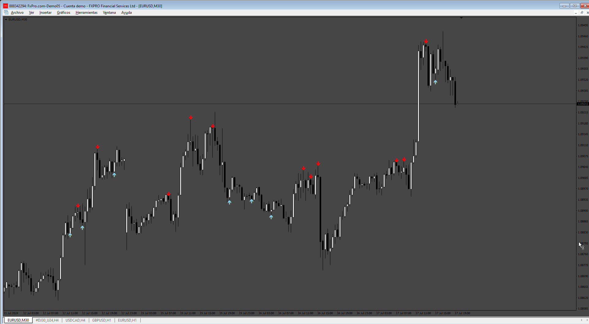
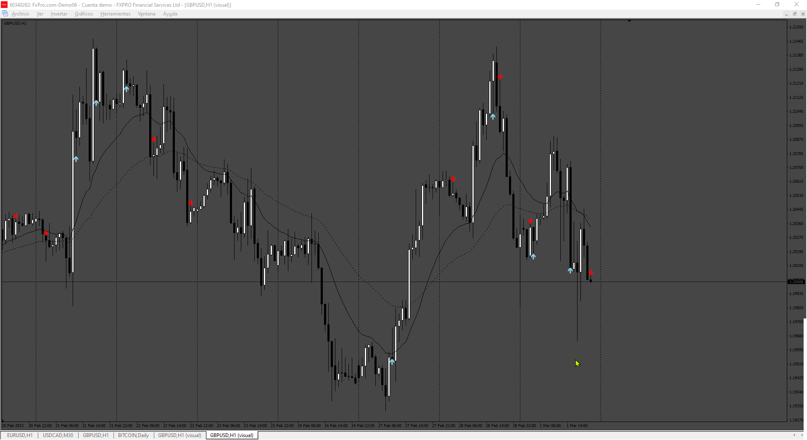

# Order block

> Source: https://fxcodebase.com/code/viewtopic.php?f=38&t=75079  
> Forum: 38 · Topic 75079 · 6 post(s)

---

## Order block

**Apprentice** · Sat Jul 20, 2024 8:11 am

Based on the request.
[https://fxcodebase.com/code/viewtopic.php?f=17&t=75053](https://fxcodebase.com/code/viewtopic.php?f=17&t=75053)

 [OB.mq4](files/156184/OB.mq4)

---

## Re: Order block

**khanatd** · Thu Oct 02, 2025 10:59 pm

hi sir , can arrow appear at close of current candle?

thanks
khan

---

## Re: Order block

**Apprentice** · Sat Oct 04, 2025 2:42 pm

We have added your request to the development list.
Development reference 629

---

## Re: Order block

**khanatd** · Sat Oct 11, 2025 12:25 am

hi sir arrow at close of current candle and never repaint disappear reappear, thanks
khan

---

## Re: Order block

**Apprentice** · Sat Oct 18, 2025 1:07 pm

 [OB_v2.mq4](files/160918/OB_v2.mq4)

---

## Re: Order block

**khanatd** · Tue Oct 21, 2025 9:40 pm

hi sir plz add mt4 non repaint arrows at close of current candle or reversals/continuations /breakouts etc

thanks
khan
