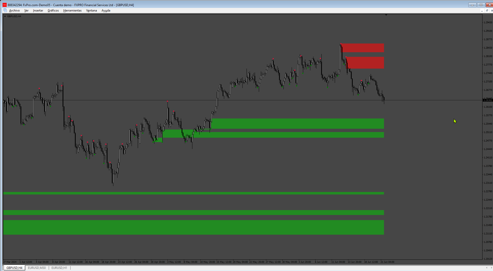

# OrderBlock_Indi

> Source: https://fxcodebase.com/code/viewtopic.php?f=38&t=75010  
> Forum: 38 · Topic 75010 · 4 post(s)

---

## OrderBlock_Indi

**Apprentice** · Tue Jun 25, 2024 1:23 pm

Based on the request.
[https://fxcodebase.com/code/viewtopic.p ... 38#p155538](https://fxcodebase.com/code/viewtopic.php?f=27&p=155538#p155538)

 [OrderBlock_Indi.mq4](files/155926/OrderBlock_Indi.mq4)

---

## Re: OrderBlock_Indi

**khanatd** · Wed Oct 01, 2025 10:59 pm

HI SIR do dots appear at close of current candle NRP? thanks, khan

---

## Re: OrderBlock_Indi

**Apprentice** · Sun Oct 12, 2025 1:33 am

[OrderBlock_Indi_nrp.mq4](files/160840/OrderBlock_Indi_nrp.mq4)

---

## Re: OrderBlock_Indi

**khanatd** · Tue Oct 21, 2025 9:44 pm

hi sir plz add mt4 non repaint arrows at close of current candle or reversals/continuations /breakouts etc

thanks
khan
