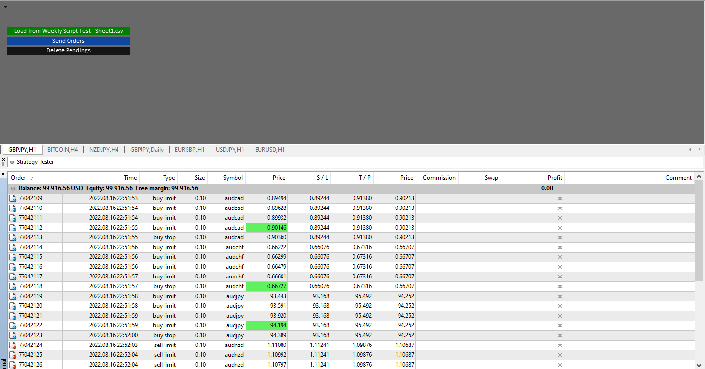
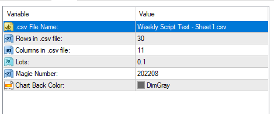

# OrdersFromCSV EA

> Source: https://fxcodebase.com/code/viewtopic.php?f=38&t=72635  
> Forum: 38 · Topic 72635 · 1 post(s)

---

## OrdersFromCSV EA

**Apprentice** · Wed Aug 17, 2022 1:43 am

 

Based on the request.
[https://fxcodebase.com/code/viewtopic.p ... 22#p147062](https://fxcodebase.com/code/viewtopic.php?f=38&t=72622#p147062)

 [OrdersFromCSV EA.mq4](files/147115/OrdersFromCSV%20EA.mq4)

"Instructions:"
 "1. Download the file like .csv with the trades that you want to send. The data would be separated by comma (,)", "\n",
"2. Put the file into the folder MQL4/Files"
"3. Press Button -Load Data- (the button turns green when having some data to send)"
"4. Press Button -Send Orders- to send the pending orders to the market"
some times the orders are too many, so the broker did not allow to send more ( error 148 )"
