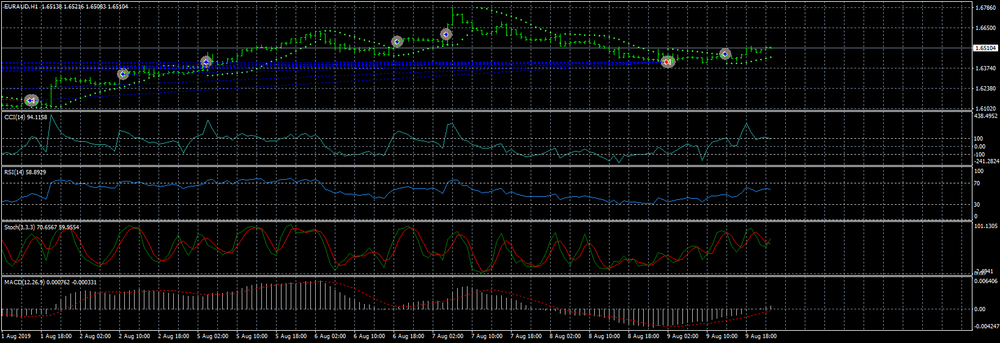
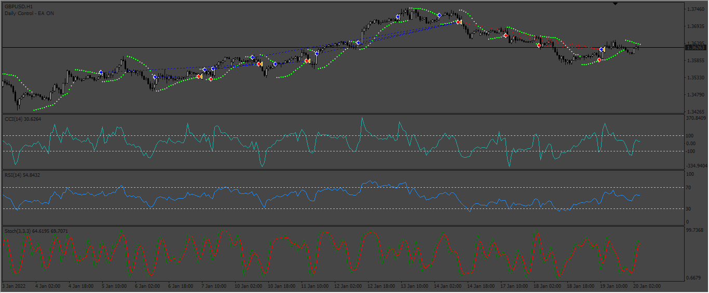
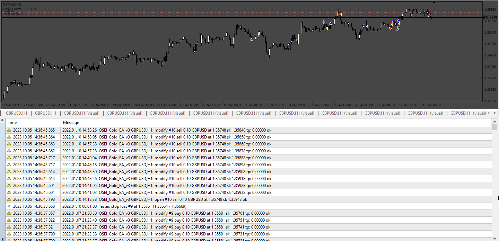
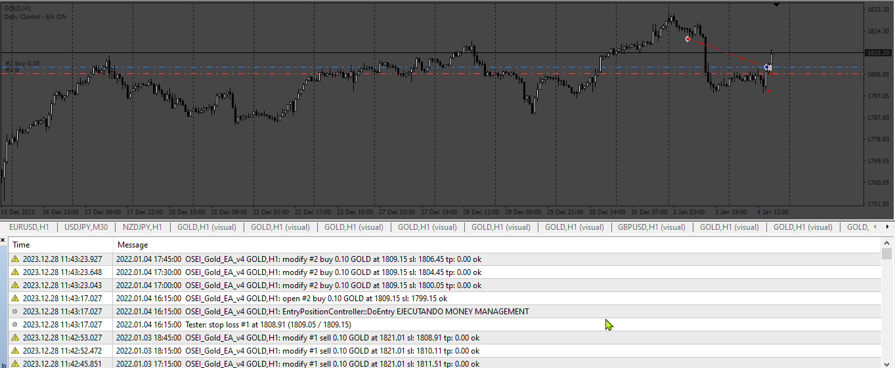
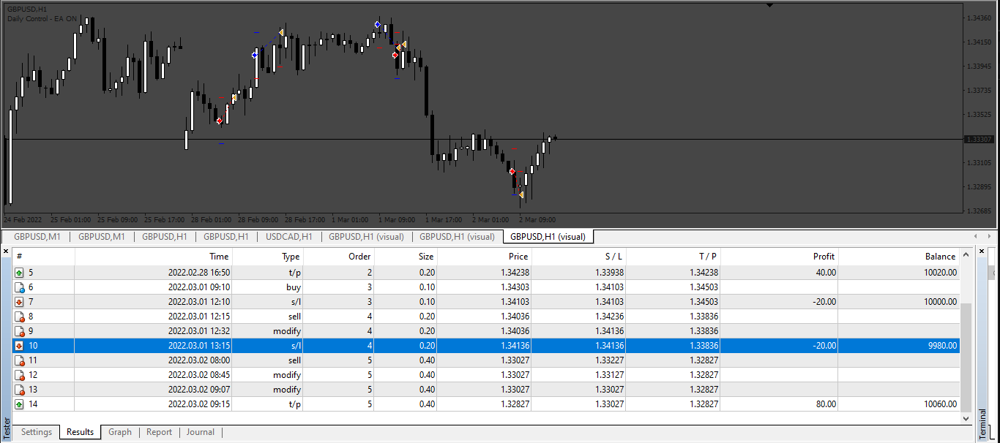
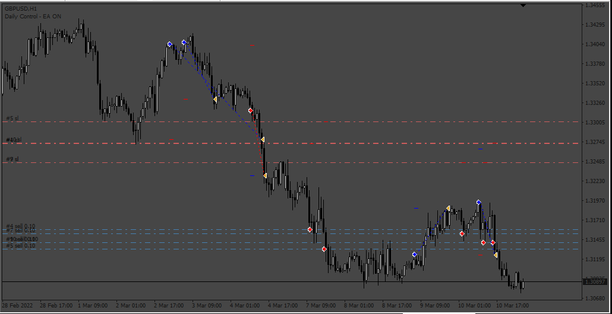

# OSEI_Gold EA

> Source: https://fxcodebase.com/code/viewtopic.php?f=38&t=70187  
> Forum: 38 · Topic 70187 · 22 post(s)

---

## OSEI_Gold EA

**Apprentice** · Fri Jul 17, 2020 5:11 am

Based on request.
[viewtopic.php?f=27&t=70183](https://fxcodebase.com/code/viewtopic.php?f=27&t=70183)

 [OSEI_Gold EA.mq4](files/136054/OSEI_Gold%20EA.mq4)

---

## Re: OSEI_Gold EA

**kwakugyau** · Fri Jul 17, 2020 1:11 pm

Thank you so much.
You have added so much to it.
As I test it, I see some errors. Please see below.
Once this is corrected, I can start optimizing it.
Thanks again.

---

## Re: OSEI_Gold EA

**Apprentice** · Sun Jul 19, 2020 5:14 pm

Your request is added to the development list.
Development reference 1726.

---

## Re: OSEI_Gold EA

**Apprentice** · Tue Jul 21, 2020 8:24 am

Close stop loss is set too close or something like that. Check your setting.

---

## Re: OSEI_Gold EA

**jimmyfan2036** · Mon Sep 04, 2023 2:19 am

Dear Apprentice,

Would like to seek your help to revise the EA as below :

1. add the week day and time filter
2. any indicator could be switched on/off.

Thanks !

---

## Re: OSEI_Gold EA

**jimmyfan2036** · Wed Sep 06, 2023 2:11 am

Dear Sir,

Would like to add the item below :

1. Session filter from Monday to Friday in specific time period and news filter
2. The indicator could be selected

Thanks !

---

## Re: OSEI_Gold EA

**Apprentice** · Sun Sep 10, 2023 3:05 pm

We have added your request to the development list.
Development reference 831.

---

## Re: OSEI_Gold EA

**Apprentice** · Sat Sep 16, 2023 4:31 am

 [OSEI_Gold_EA_v2.mq4](files/152598/OSEI_Gold_EA_v2.mq4)

---

## Re: OSEI_Gold EA

**rickCreations** · Sun Sep 17, 2023 5:01 am

i turned off all TP and SL and close on opposite signal. still getting ORDER MODIFY ERROR 130

---

## Re: OSEI_Gold EA

**Apprentice** · Mon Sep 25, 2023 3:31 am

We have added your request to the development list.
Development reference 877.

---

## Re: OSEI_Gold EA

**Apprentice** · Sun Oct 08, 2023 3:50 am

 [OSEI_Gold_EA_v3.mq4](files/152854/OSEI_Gold_EA_v3.mq4)

---

## Re: OSEI_Gold EA

**rickCreations** · Sun Oct 08, 2023 9:31 am

[quote="Apprentice"]

877.png

OSEI_Gold_EA_v3.mq4

Version 3 is having issues with TSL (trailingstop) it isn't activating in backtest at all even when setting both values to 1

---

## Re: OSEI_Gold EA

**rickCreations** · Sun Oct 08, 2023 11:44 pm

> **Apprentice wrote:**
>
>
> 877.png
>
>
>
>
> OSEI_Gold_EA_v3.mq4

Issues Trailing stop Doesn't work at all. doesn't move the SL at all and yes i tried with SL disabled and enabled. i tried values from 0.1-100 didn't work

Breakeven is Causing OrderModify Error 130

---

## Re: OSEI_Gold EA

**Apprentice** · Thu Oct 12, 2023 3:53 am

We have added your request to the development list.
Development reference 916

---

## Re: OSEI_Gold EA

**Apprentice** · Wed Jan 03, 2024 5:39 am

 [OSEI_Gold_EA_v4.mq4](files/153912/OSEI_Gold_EA_v4.mq4)

---

## Re: OSEI_Gold EA

**Spikeus** · Tue Jan 16, 2024 12:55 pm

You can add GRID STEP on LOTS on opossite signal on this EA?

Example,
When the EA follows the trend, it can continue using 0.01, how are.
But, the 'orders' that were left behind, "he start duplicate the lot", this is possible!?
If it is not possible to duplicate the lots in opposite signs, you can double them in all, is better.

thank you so mutch!

---

## Re: OSEI_Gold EA

**Apprentice** · Sat Jan 20, 2024 4:36 am

We have added your request to the development list.
Development reference 84

---

## Re: OSEI_Gold EA

**Spikeus** · Sat Jan 20, 2024 12:16 pm

> **Apprentice wrote:**
> We have added your request to the development list.
> Development reference 84

Thank you so mutch!

---

## Re: OSEI_Gold EA

**Apprentice** · Mon Jan 22, 2024 7:50 am

 [OSEI_Gold_EA_v5.mq4](files/154146/OSEI_Gold_EA_v5.mq4)

---

## Re: OSEI_Gold EA

**kenny22** · Sat Feb 24, 2024 7:10 am

Hello sir,
1: Stop loss selection is set in ATR(value) * mult. EA only opens long orders, not short orders.
2: TakeProfitType selects Set in ATR(value) * mult, the TP value of buy order is normal, and the TP value of sell order is abnormal. If the sell order appears TP, you will lose money.
Please modify it, thank you.

---

## Re: OSEI_Gold EA

**Apprentice** · Sat Feb 24, 2024 2:24 pm

We have added your request to the development list.
Development reference 172

---

## Re: OSEI_Gold EA

**Apprentice** · Sun Mar 03, 2024 7:39 am

 [OSEI_Gold_EA_v6.mq4](files/154573/OSEI_Gold_EA_v6.mq4)
