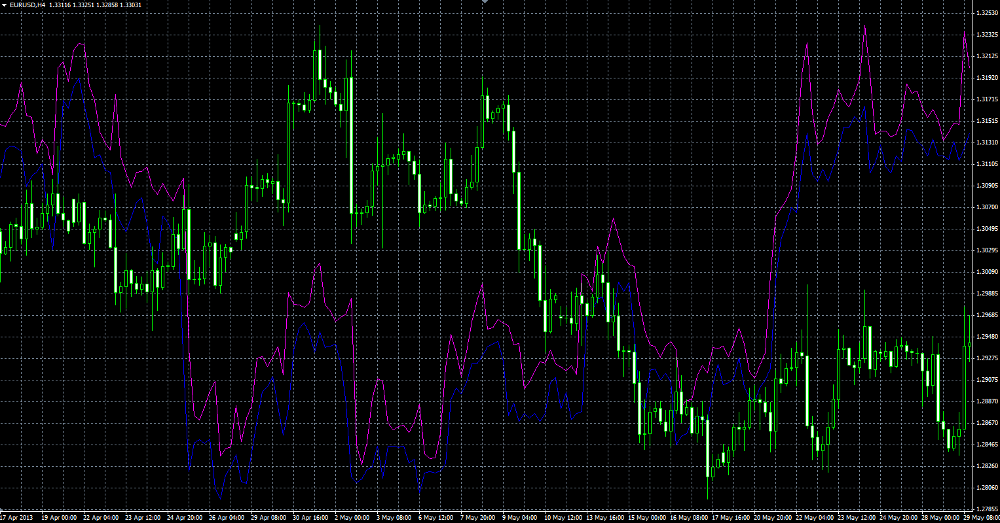

# Other symbol on the main chart.

> Source: https://fxcodebase.com/code/viewtopic.php?f=38&t=40844  
> Forum: 38 · Topic 40844 · 1 post(s)

---

## Other symbol on the main chart.

**Alexander.Gettinger** · Thu Jun 13, 2013 1:50 pm

The indicator draws the selected symbol on the main chart.

 

Download:

 [OtherSymbolOnChart.mq4](files/66878/OtherSymbolOnChart.mq4)

Important! Charts of different symbols have different price ranges.
