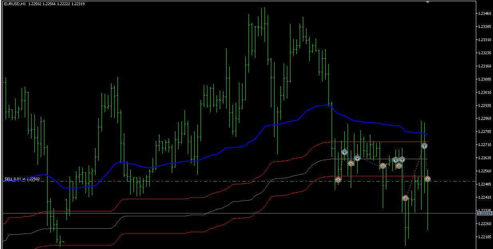

# OTT AND PRICE CROSS EA

> Source: https://fxcodebase.com/code/viewtopic.php?f=38&t=71951  
> Forum: 38 · Topic 71951 · 8 post(s)

---

## OTT AND PRICE CROSS EA

**Apprentice** · Wed Mar 09, 2022 3:21 pm

Based on the request.
[https://fxcodebase.com/code/viewtopic.php?f=27&p=145099](https://fxcodebase.com/code/viewtopic.php?f=27&p=145099)

 [OTT AND PRICE CROSS EA.mq5](files/145283/OTT%20AND%20PRICE%20CROSS%20EA.mq5)

 [TGInd-TOTT-01.mq5](files/145283/TGInd-TOTT-01.mq5)

---

## Re: OTT AND PRICE CROSS EA

**FXTRADER20** · Thu Mar 10, 2022 6:07 am

Hello,

First of all, thank you very much for your support.

When I start a backtest, it enters a buy and sell transaction at the same time.

I checked the settings, everything seems fine.

Best regards,

---

## Re: OTT AND PRICE CROSS EA

**FXTRADER20** · Tue Apr 05, 2022 1:00 pm

help me please

---

## Re: OTT AND PRICE CROSS EA

**Apprentice** · Wed Apr 06, 2022 9:49 am

Your request is added to the development list.
Development reference 209.

---

## Re: OTT AND PRICE CROSS EA

**Apprentice** · Wed Apr 13, 2022 12:01 pm

Try it now.

---

## Re: OTT AND PRICE CROSS EA

**FXTRADER20** · Tue Apr 19, 2022 9:36 am

Sorry, it doesn't really work, can you check?

---

## Re: OTT AND PRICE CROSS EA

**Apprentice** · Thu Apr 21, 2022 3:16 am

Your request is added to the development list.
Development reference 254.

---

## Re: OTT AND PRICE CROSS EA

**FXTRADER20** · Thu Aug 04, 2022 1:50 pm

help me
