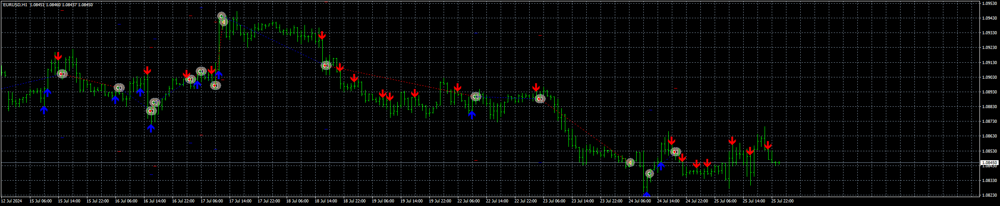

# Outside_Late_Dir_EA

> Source: https://fxcodebase.com/code/viewtopic.php?f=38&t=75090  
> Forum: 38 · Topic 75090 · 4 post(s)

---

## Outside_Late_Dir_EA

**Apprentice** · Thu Jul 25, 2024 4:27 pm

Based on the request.
[https://fxcodebase.com/code/viewtopic.p ... 77#p156177](https://fxcodebase.com/code/viewtopic.php?f=27&p=156177#p156177)

 [Outside_Late_Dir.mq4](files/156231/Outside_Late_Dir.mq4)

 [Outside_Late_Dir_EA_v1.00.mq4](files/156231/Outside_Late_Dir_EA_v1.00.mq4)

---

## Re: Outside_Late_Dir_EA

**pang19** · Tue Sep 24, 2024 12:35 am

is this possible to be multipair EA?
Could you please make it ?

---

## Re: Outside_Late_Dir_EA

**Apprentice** · Tue Oct 01, 2024 5:49 am

Explain how multipair EA will work?

---

## Re: Outside_Late_Dir_EA

**pang19** · Tue Dec 03, 2024 10:10 pm

How about indicator possible to add alert push when the price closed.

How can it work in Multipair?
