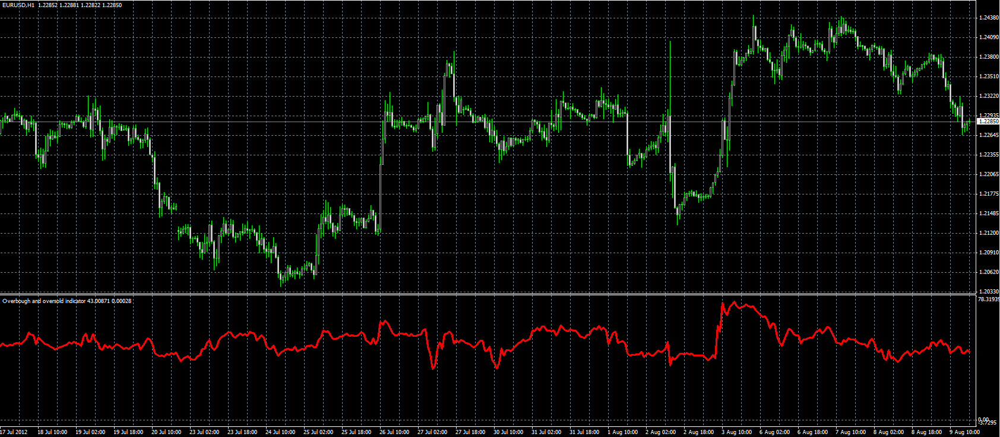

# Overbought and oversold indicator

> Source: https://fxcodebase.com/code/viewtopic.php?f=38&t=22222  
> Forum: 38 · Topic 22222 · 9 post(s)

---

## Overbought and oversold indicator

**Alexander.Gettinger** · Thu Aug 09, 2012 1:31 pm

Formula:

Overbought_Oversold=(MA/ATR)*100, where
MA - moving average for (Close-Low) with Length as period,
ATR - average true range with Length as period.

 

Download:

 [Overbough_Oversold.mq4](files/38444/Overbough_Oversold.mq4)

---

## Re: Overbought and oversold indicator

**Alexander.Gettinger** · Fri Aug 10, 2012 2:43 pm

LUA version of this indicator: [viewtopic.php?f=17&t=22268](https://fxcodebase.com/code/viewtopic.php?f=17&t=22268)

---

## Re: Overbought and oversold indicator

**Jeffreyvnlk** · Mon Aug 20, 2012 6:26 am

Simple as RSI, 70 and 30

---

## Re: Overbought and oversold indicator

**Apprentice** · Wed Aug 22, 2012 1:48 am

If I understand you, you want to add lines to 30 and 70.

---

## Re: Overbought and oversold indicator

**arindam89** · Fri Aug 24, 2012 4:47 am

[moderated: wrong location]

---

## Re: Overbought and oversold indicator

**Apprentice** · Mon Aug 27, 2012 6:17 am

Your request is added to the development list.
Why do you need me to install an indicator, on your computer.

---

## Re: Overbought and oversold indicator

**Jeffreyvnlk** · Mon Oct 22, 2012 9:51 pm

> **Apprentice wrote:**
> If I understand you, you want to add lines to 30 and 70.

Appreciated if you can add that bonus option

---

## Re: Overbought and oversold indicator

**Apprentice** · Sun Oct 28, 2012 9:03 am

OB/OS Lines Added.

---

## Re: Overbought and oversold indicator

**Jeffreyvnlk** · Mon Oct 29, 2012 9:32 pm

> **Apprentice wrote:**
> OB/OS Lines Added.

So nice, thanks
