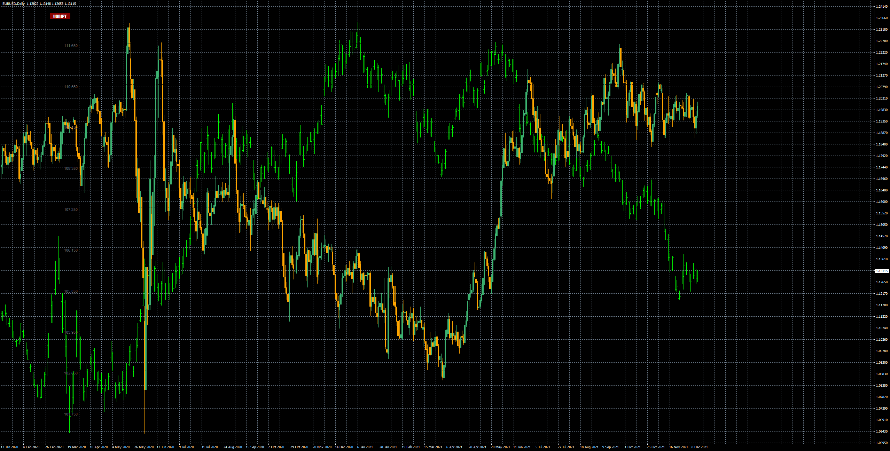
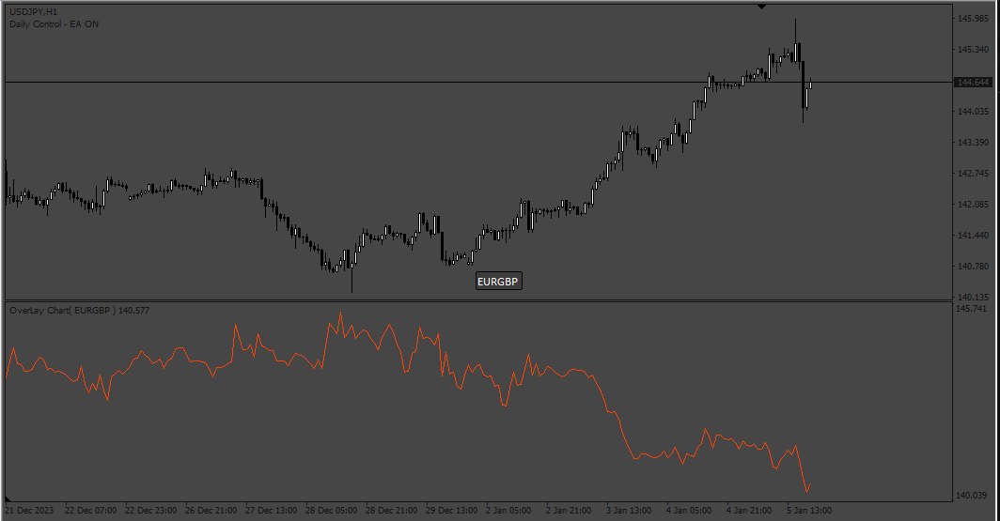

# OverLayChart_button

> Source: https://fxcodebase.com/code/viewtopic.php?f=38&t=71912  
> Forum: 38 · Topic 71912 · 5 post(s)

---

## OverLayChart_button

**Apprentice** · Wed Feb 23, 2022 7:34 am

Based on the request.
[https://fxcodebase.com/code/viewtopic.php?f=38&t=71569](https://fxcodebase.com/code/viewtopic.php?f=38&t=71569)

 [OverLayChart_button.mq4](files/145140/OverLayChart_button.mq4)

 [OverLayChart_v2.mq5](files/145140/OverLayChart_v2.mq5)

---

## Re: OverLayChart_button

**Thangaraj** · Wed Aug 16, 2023 11:17 am

> **Apprentice wrote:**
>
>
> eurusd-d1-fxcm-australia-pty-2.png
>
>
> Based on the request.
> [https://fxcodebase.com/code/viewtopic.php?f=38&t=71569](https://fxcodebase.com/code/viewtopic.php?f=38&t=71569)
>
>
> OverLayChart_button.mq4

Please Convert this Indicator into MT5 , it will be useful for all of us..Thank you

---

## Re: OverLayChart_button

**Apprentice** · Wed Aug 16, 2023 2:17 pm

We have added your request to the development list.
Development reference 709.

---

## Re: OverLayChart_button

**Apprentice** · Sat Jan 06, 2024 2:16 am

 [OverLayChart_v2.mq4](files/153929/OverLayChart_v2.mq4)

 [OverLayChart_v2.mq5](files/153929/OverLayChart_v2.mq5)

---

## Re: OverLayChart_button

**Apprentice** · Thu Aug 07, 2025 3:40 am

MT5 version added.
