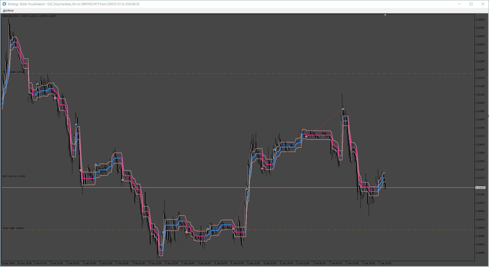

# Ozzymandias_EA

> Source: https://fxcodebase.com/code/viewtopic.php?f=38&t=75030  
> Forum: 38 · Topic 75030 · 6 post(s)

---

## Ozzymandias_EA

**Apprentice** · Fri Jul 05, 2024 3:29 am

Based on the request.
[https://fxcodebase.com/code/viewtopic.php?f=17&t=75003](https://fxcodebase.com/code/viewtopic.php?f=17&t=75003)

 [ozymandias.ex5](files/156005/ozymandias.ex5)

 [Ozzymandias_EA.mq5](files/156005/Ozzymandias_EA.mq5)

---

## Re: Ozzymandias_EA

**trigga** · Sat Nov 30, 2024 7:50 am

Hie i need this Ea to open buy entry when color changes to blue and open sell entry when colour is pink. its not opening entries , may you please fix it. allow for immediate entry and also after candle close. Also allow for close on opposite. i use this a lot and it will be amazing having it as a working Ea.

please rename it to KueFx Motor Ea

---

## Re: Ozzymandias_EA

**trigga** · Sat Nov 30, 2024 7:58 am

Ea wont install, it says Ea need an indicator Mql4/indicator folder but its an Ea for mt5 . please fix Ea. need this to work

---

## Re: Ozzymandias_EA

**trigga** · Mon Dec 02, 2024 11:02 am

i rily need this to work. it keeps giving error on installation. says Ea need an indicator install in MqL4/indicators. need it to work for mt5. Please fix it.

---

## Re: Ozzymandias_EA

**Apprentice** · Thu Dec 05, 2024 1:32 pm

We have added your request to the development list.
Development reference 894

---

## Re: Ozzymandias_EA

**Apprentice** · Fri Dec 13, 2024 3:26 pm

Try this version.

 [KueFx_Motor_v1.00.mq5](files/157527/KueFx_Motor_v1.00.mq5)

 [KueFx_Motor_EA_v1.00.mq5](files/157527/KueFx_Motor_EA_v1.00.mq5)
