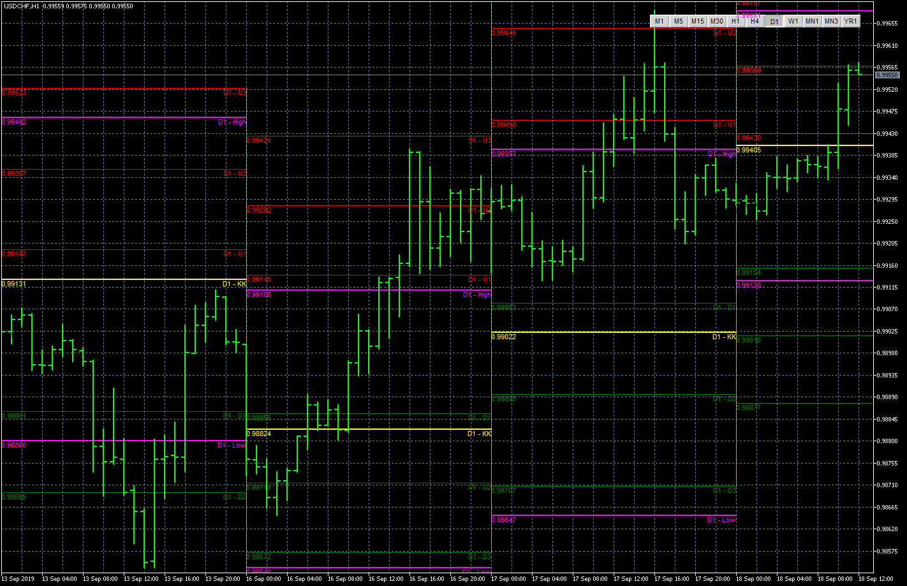

# P.S.N.

> Source: https://fxcodebase.com/code/viewtopic.php?f=38&t=68928  
> Forum: 38 · Topic 68928 · 10 post(s)

---

## P.S.N.

**Apprentice** · Wed Sep 18, 2019 5:57 am

Based on request.
[viewtopic.php?f=27&t=68837](https://fxcodebase.com/code/viewtopic.php?f=27&t=68837)

 [P.S.N.mq5](files/128738/P.S.N.mq5)

---

## Re: P.S.N.

**syncoopate** · Wed Sep 18, 2019 8:37 am

thank you very much for all those who have made the download if they want to have clarifications on how to use, they can write to [[email protected]](https://fxcodebase.com/cdn-cgi/l/email-protection#305642515e5359515d5145425f705c595255425f1e5944)

---

## Re: P.S.N. Little problem

**syncoopate** · Sun Sep 22, 2019 5:31 pm

Hi, the converisone is almost perfect ... we have to solve a small problem for the end of the period. The lines must end at the end of the selected period, now they continue beyond the period. Thanks for everything for helping this great project .. .Syncoopate

attached an example of the error on an annual period.

---

## Re: P.S.N.

**Apprentice** · Mon Sep 23, 2019 5:48 am

Your request is added to the development list.
Development reference 112.

---

## Re: P.S.N.

**Apprentice** · Mon Sep 30, 2019 6:31 am

Try it now.

---

## Problem With end period level line and start future level li

**syncoopate** · Mon Sep 30, 2019 1:14 pm

Hello Apprentice, in the attached image I'll show you what needs to be fixed ... the current levels must end at the end of the chosen period, while the future periods I have to start on the new future period .... and anyway I think there are also problems of cancellation and refresh of the levels ....... we can finish this splendid project ... Thank you so many infinite

---

## Re: P.S.N.

**Apprentice** · Wed Oct 02, 2019 6:01 am

Your request is added to the development list.
Development reference 146.

---

## Re: P.S.N.

**Apprentice** · Wed Oct 09, 2019 1:25 pm

Try it now.

---

## Re: P.S.N.

**DarkSam** · Fri Aug 07, 2020 12:03 am

Hi,

Can make EA on MT5 for P.S.N ?

And need to ask what is mean level KK ?

Thank you

---

## Re: P.S.N.

**Apprentice** · Fri Aug 07, 2020 4:38 am

Can you define the EA rules?
