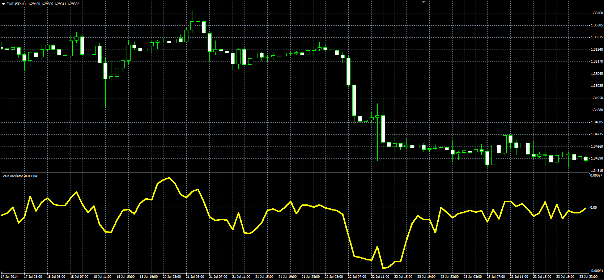

# Pain oscillator

> Source: https://fxcodebase.com/code/viewtopic.php?f=38&t=61157  
> Forum: 38 · Topic 61157 · 1 post(s)

---

## Pain oscillator

**Alexander.Gettinger** · Mon Sep 15, 2014 12:41 pm

Original LUA oscillator: [viewtopic.php?f=17&t=32520](https://fxcodebase.com/code/viewtopic.php?f=17&t=32520).

Formula:
Pain = (3*MA(Close) - MA(Open) - MA(High) - MA(Low))/2, where
MA - moving average with [Length] number of periods and [Method] type.

 

Download:

 [Pain.mq4](files/95911/Pain.mq4)
