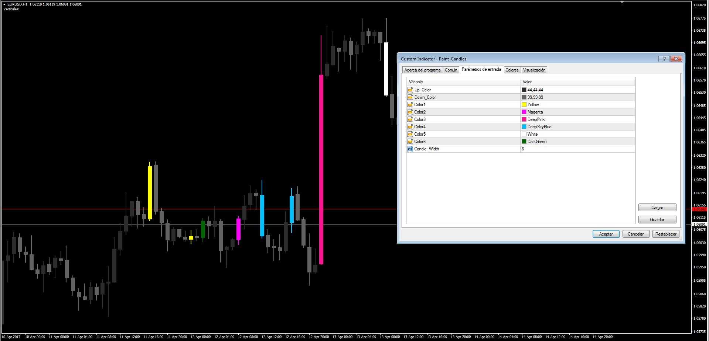
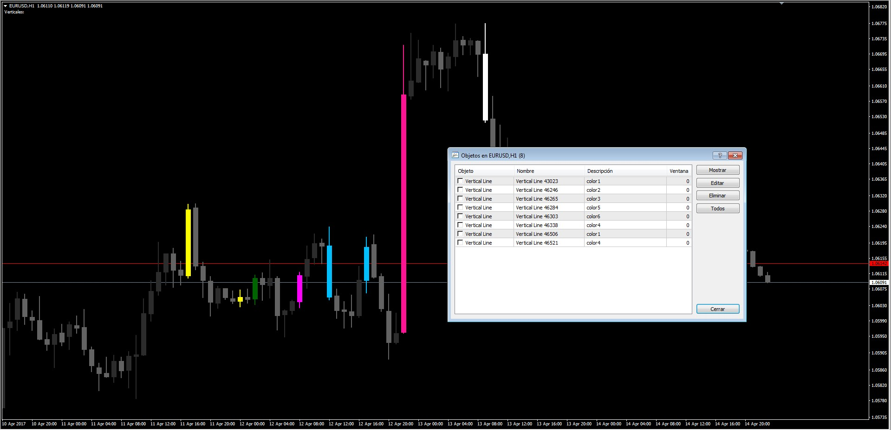

# Paint Candles

> Source: https://fxcodebase.com/code/viewtopic.php?f=38&t=64598  
> Forum: 38 · Topic 64598 · 1 post(s)

---

## Paint Candles

**Apprentice** · Mon Apr 17, 2017 3:09 am

 

TS2 / Lua Version.
[viewtopic.php?f=17&t=16320](https://fxcodebase.com/code/viewtopic.php?f=17&t=16320)

Description:

This request was asking to have a MT4 version of this nice LUA indicator. Because of the difference in how to deal with each candle and objects it was a challenge. This means that a few things are different.

Mode of use:

- Draw a vertical line in the candle that you want to put a custom color
- Open its properties window and change its description to color1, color2, color3, color4, color5 or color6
- The vertical line will "dissapear" (in reality it will turn the same color as the chart background color)
- The candle will paint according to the selected color in the indicator's parameters window

The indicator also paints the candles according to the selected up and down color choosed by default.

Note: Press F8 (chart properties) and put the candles in the background so they don't interfere with the indicator colors.

 [Paint_Candles.mq4](files/112010/Paint_Candles.mq4)
