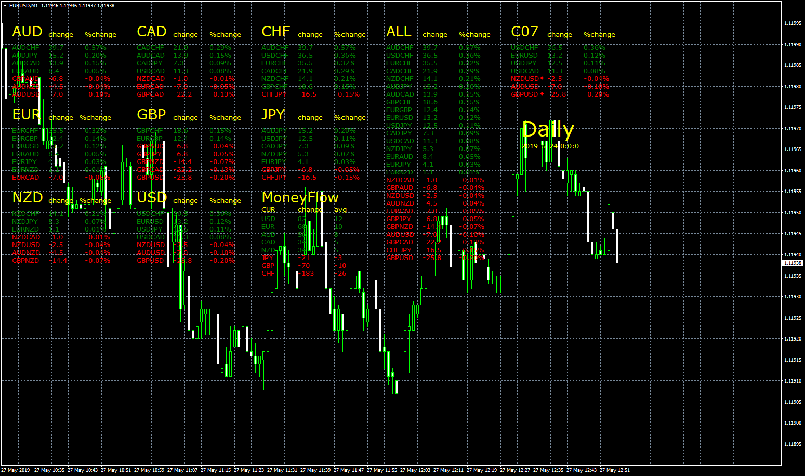

# PairsPercentChange

> Source: https://fxcodebase.com/code/viewtopic.php?f=38&t=68513  
> Forum: 38 · Topic 68513 · 8 post(s)

---

## PairsPercentChange

**Apprentice** · Mon May 27, 2019 6:50 am

Based on request.
[viewtopic.php?f=27&t=68505](https://fxcodebase.com/code/viewtopic.php?f=27&t=68505)

 [PairsPercentChange.mq4](files/126566/PairsPercentChange.mq4)

TS2 Version
[https://fxcodebase.com/code/viewtopic.php?f=17&t=71252](https://fxcodebase.com/code/viewtopic.php?f=17&t=71252)

---

## Re: PairsPercentChange

**syncoopate** · Thu May 30, 2019 6:48 am

I tried, but the compiler tells me errors ...

---

## Re: PairsPercentChange

**Apprentice** · Fri May 31, 2019 7:03 am

That are warnings, not errors.

---

## Re: PairsPercentChange

**syncoopate** · Fri May 31, 2019 11:01 am

But not view a list on the chart

---

## Re: PairsPercentChange

**Apprentice** · Mon Jun 03, 2019 6:28 am

I have no issues with it. Take a look at the experts tab. If there are any error then you will see some on that tab.

---

## Re: PairsPercentChange

**newton** · Wed May 26, 2021 9:25 am

Hi,
Can u create it for trade station.
Thank u.

---

## Re: PairsPercentChange

**Apprentice** · Thu May 27, 2021 4:29 am

Your request is added to the development list.
Development reference 529.

---

## Re: PairsPercentChange

**Apprentice** · Wed Jun 02, 2021 8:42 am

TS2 Version
[https://fxcodebase.com/code/viewtopic.php?f=17&t=71252](https://fxcodebase.com/code/viewtopic.php?f=17&t=71252)
